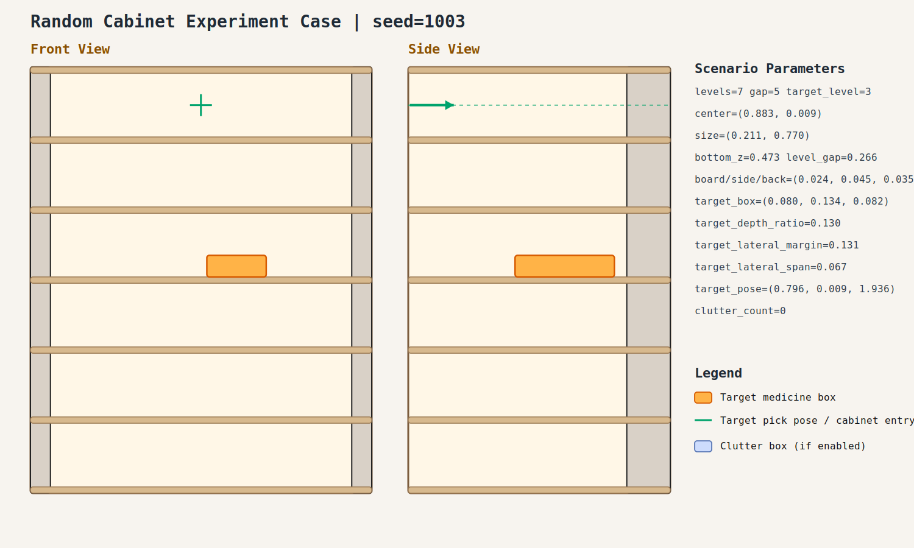
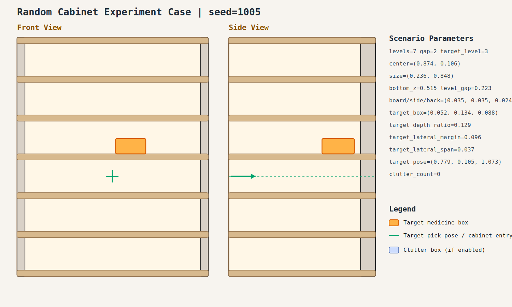

# Random Cabinet Experiment Record: 20260408_202226_random_cabinet_experiment

- Total cases: `5`
- Successful cases: `5`
- Success ratio: `100.0%`

## Cases

### case_001

- Seed: `1001`
- Success: `True`
- Final stage: `COMPLETED`
- Shelf size (depth,width): `(0.208, 0.839)`
- Shelf center: `(0.970, 0.013)`
- Shelf bottom / level gap: `(0.468, 0.208)`
- Target box size: `(0.052, 0.156, 0.085)`
- Video recorded: `False`
- Failure message: `N/A`
- Stage durations:
- `ACQUIRE_TARGET`: 0.013s
- `ARM_STOW_SAFE`: 2.303s
- `BASE_ENTER_WORKSPACE`: 2.718s
- `LIFT_TO_BAND`: 2.212s
- `SELECT_PRE_INSERT`: 0.003s
- `PLAN_TO_PRE_INSERT`: 1.593s
- `INSERT_AND_SUCTION`: 0.625s
- `SAFE_RETREAT`: 3.269s
- Detailed record: [README.md](./case_001/README.md)

### case_002

- Seed: `1002`
- Success: `True`
- Final stage: `COMPLETED`
- Shelf size (depth,width): `(0.200, 0.886)`
- Shelf center: `(0.850, -0.090)`
- Shelf bottom / level gap: `(0.505, 0.200)`
- Target box size: `(0.083, 0.090, 0.075)`
- Video recorded: `False`
- Failure message: `N/A`
- Stage durations:
- `ACQUIRE_TARGET`: 0.089s
- `ARM_STOW_SAFE`: 2.304s
- `BASE_ENTER_WORKSPACE`: 2.714s
- `LIFT_TO_BAND`: 2.213s
- `SELECT_PRE_INSERT`: 0.003s
- `PLAN_TO_PRE_INSERT`: 1.593s
- `INSERT_AND_SUCTION`: 0.637s
- `SAFE_RETREAT`: 3.273s
- Detailed record: [README.md](./case_002/README.md)

### case_003

- Seed: `1003`
- Success: `True`
- Final stage: `COMPLETED`
- Shelf size (depth,width): `(0.211, 0.770)`
- Shelf center: `(0.883, 0.009)`
- Shelf bottom / level gap: `(0.473, 0.266)`
- Target box size: `(0.080, 0.134, 0.082)`
- Video recorded: `False`
- Failure message: `N/A`
- Stage durations:
- `ACQUIRE_TARGET`: 0.269s
- `ARM_STOW_SAFE`: 2.303s
- `BASE_ENTER_WORKSPACE`: 1.019s
- `LIFT_TO_BAND`: 2.213s
- `SELECT_PRE_INSERT`: 0.005s
- `PLAN_TO_PRE_INSERT`: 2.117s
- `INSERT_AND_SUCTION`: 0.648s
- `SAFE_RETREAT`: 3.226s
- Detailed record: [README.md](./case_003/README.md)

### case_004

- Seed: `1004`
- Success: `True`
- Final stage: `COMPLETED`
- Shelf size (depth,width): `(0.281, 0.616)`
- Shelf center: `(0.897, 0.041)`
- Shelf bottom / level gap: `(0.515, 0.275)`
- Target box size: `(0.059, 0.129, 0.044)`
- Video recorded: `False`
- Failure message: `N/A`
- Stage durations:
- `ACQUIRE_TARGET`: 0.469s
- `ARM_STOW_SAFE`: 2.211s
- `BASE_ENTER_WORKSPACE`: 2.717s
- `LIFT_TO_BAND`: 2.212s
- `SELECT_PRE_INSERT`: 0.004s
- `PLAN_TO_PRE_INSERT`: 1.577s
- `INSERT_AND_SUCTION`: 0.611s
- `SAFE_RETREAT`: 3.268s
- Detailed record: [README.md](./case_004/README.md)

### case_005

- Seed: `1005`
- Success: `True`
- Final stage: `COMPLETED`
- Shelf size (depth,width): `(0.236, 0.848)`
- Shelf center: `(0.874, 0.106)`
- Shelf bottom / level gap: `(0.515, 0.223)`
- Target box size: `(0.052, 0.134, 0.088)`
- Video recorded: `False`
- Failure message: `N/A`
- Stage durations:
- `ACQUIRE_TARGET`: 0.479s
- `ARM_STOW_SAFE`: 2.309s
- `BASE_ENTER_WORKSPACE`: 2.713s
- `LIFT_TO_BAND`: 2.213s
- `SELECT_PRE_INSERT`: 0.003s
- `PLAN_TO_PRE_INSERT`: 1.587s
- `INSERT_AND_SUCTION`: 0.646s
- `SAFE_RETREAT`: 3.278s
- Detailed record: [README.md](./case_005/README.md)
