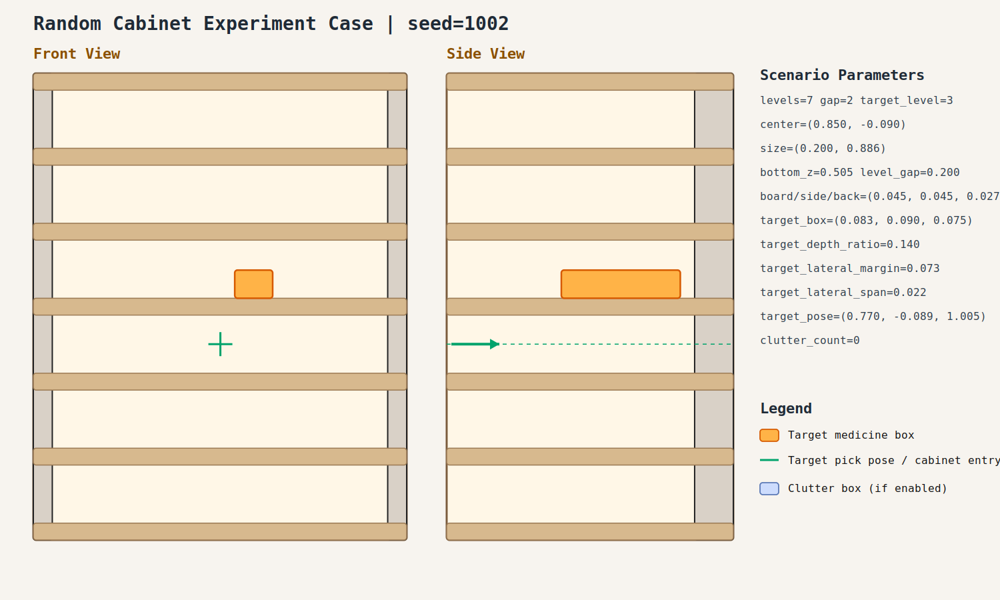

# case_002

## Result

- Success: `True`
- Final stage: `COMPLETED`

## Parameters

- Seed: `1002`
- Shelf levels: `7`
- Target gap index: `2`
- Target level: `3`
- Shelf center: `(0.850, -0.090)`
- Shelf size (depth,width): `(0.200, 0.886)`
- Shelf bottom / level gap: `(0.505, 0.200)`
- Shelf board / side / back thickness: `(0.045, 0.045, 0.027)`
- Target box size: `(0.083, 0.090, 0.075)`
- Target pose: `(0.770, -0.089, 1.005)`

## Stage Durations

- `ACQUIRE_TARGET`: 0.089s
- `ARM_STOW_SAFE`: 2.304s
- `BASE_ENTER_WORKSPACE`: 2.714s
- `LIFT_TO_BAND`: 2.213s
- `SELECT_PRE_INSERT`: 0.003s
- `PLAN_TO_PRE_INSERT`: 1.593s
- `INSERT_AND_SUCTION`: 0.637s
- `SAFE_RETREAT`: 3.273s

## Video

- No video metadata was generated for this case.

## Files

- `scene.svg`: cabinet image
- `params.json`: generated cabinet parameters
- `result.json`: parsed experiment result
- `run.log`: raw ROS/MoveIt log
