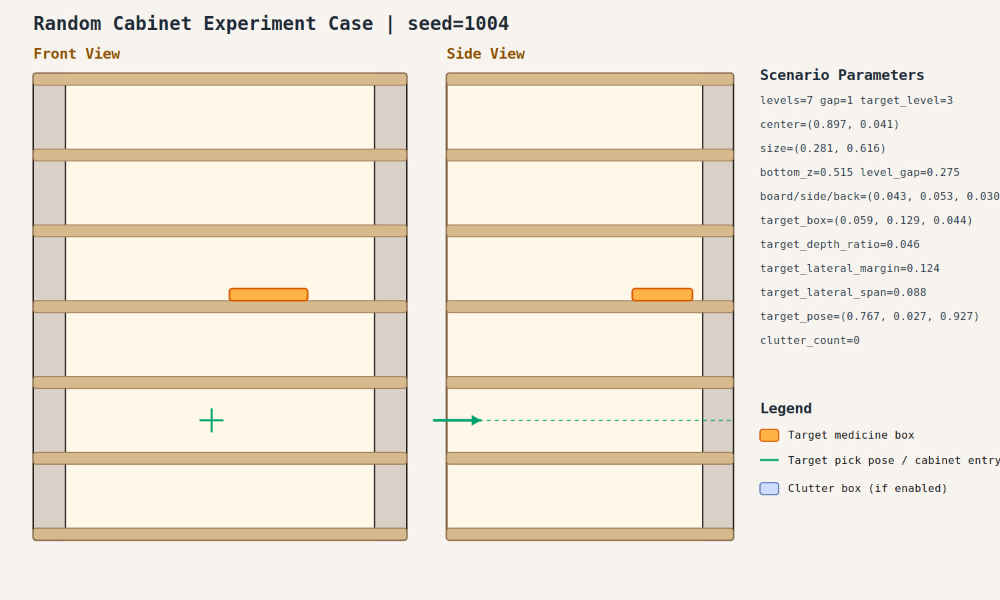

# case_004

## Result

- Success: `True`
- Final stage: `COMPLETED`

## Parameters

- Seed: `1004`
- Shelf levels: `7`
- Target gap index: `1`
- Target level: `3`
- Shelf center: `(0.897, 0.041)`
- Shelf size (depth,width): `(0.281, 0.616)`
- Shelf bottom / level gap: `(0.515, 0.275)`
- Shelf board / side / back thickness: `(0.043, 0.053, 0.030)`
- Target box size: `(0.059, 0.129, 0.044)`
- Target pose: `(0.767, 0.027, 0.927)`

## Stage Durations

- `ACQUIRE_TARGET`: 0.469s
- `ARM_STOW_SAFE`: 2.211s
- `BASE_ENTER_WORKSPACE`: 2.717s
- `LIFT_TO_BAND`: 2.212s
- `SELECT_PRE_INSERT`: 0.004s
- `PLAN_TO_PRE_INSERT`: 1.577s
- `INSERT_AND_SUCTION`: 0.611s
- `SAFE_RETREAT`: 3.268s

## Video

- No video metadata was generated for this case.

## Files

- `scene.svg`: cabinet image
- `params.json`: generated cabinet parameters
- `result.json`: parsed experiment result
- `run.log`: raw ROS/MoveIt log
