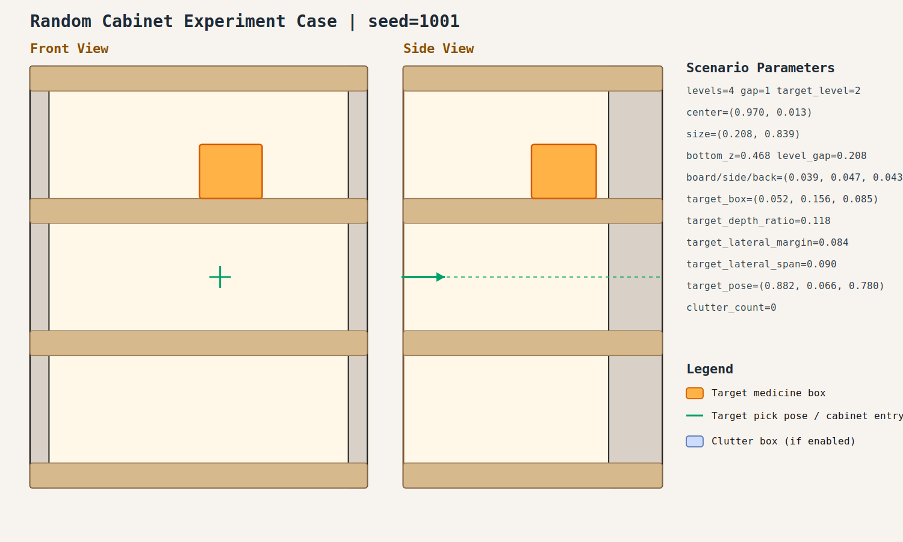

# Random Cabinet Experiment Record: 20260408_204338_random_cabinet_experiment

- Total cases: `1`
- Successful cases: `1`
- Success ratio: `100.0%`

## Cases

### case_001

- Seed: `1001`
- Success: `True`
- Final stage: `COMPLETED`
- Shelf size (depth,width): `(0.208, 0.839)`
- Shelf center: `(0.970, 0.013)`
- Shelf bottom / level gap: `(0.468, 0.208)`
- Target box size: `(0.052, 0.156, 0.085)`
- Video recorded: `False`
- Failure message: `N/A`
- Stage durations:
- `ACQUIRE_TARGET`: 0.045s
- `ARM_STOW_SAFE`: 2.303s
- `BASE_ENTER_WORKSPACE`: 2.712s
- `LIFT_TO_BAND`: 2.212s
- `SELECT_PRE_INSERT`: 0.005s
- `PLAN_TO_PRE_INSERT`: 1.633s
- `INSERT_AND_SUCTION`: 0.634s
- `SAFE_RETREAT`: 3.271s
- Detailed record: [README.md](./case_001/README.md)
