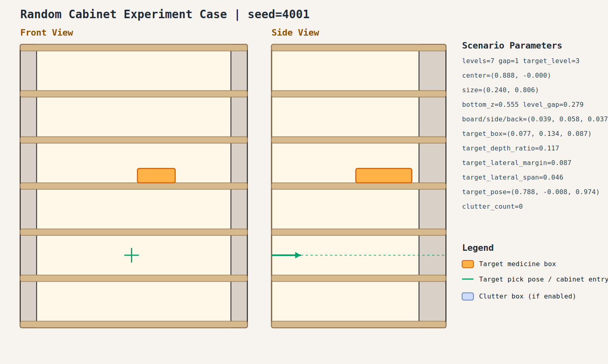
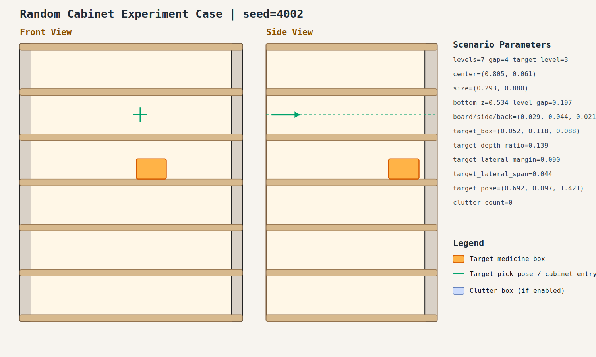

# Random Cabinet Experiment Record: 20260408_210657_random_cabinet_experiment

- Total cases: `8`
- Successful cases: `4`
- Success ratio: `50.0%`
- Failure analysis: [analysis.md](./analysis.md)

## Cases

### case_001

- Seed: `4001`
- Success: `False`
- Final stage: `ACQUIRE_TARGET`
- Shelf size (depth,width): `(0.240, 0.806)`
- Shelf center: `(0.888, -0.000)`
- Shelf bottom / level gap: `(0.555, 0.279)`
- Target box size: `(0.077, 0.134, 0.087)`
- Video recorded: `False`
- Failure message: `N/A`
- Stage durations:
No stage timeline parsed.
- Detailed record: [README.md](./case_001/README.md)

### case_002

- Seed: `4002`
- Success: `True`
- Final stage: `COMPLETED`
- Shelf size (depth,width): `(0.293, 0.880)`
- Shelf center: `(0.805, 0.061)`
- Shelf bottom / level gap: `(0.534, 0.197)`
- Target box size: `(0.052, 0.118, 0.088)`
- Video recorded: `False`
- Failure message: `N/A`
- Stage durations:
- `ACQUIRE_TARGET`: 4.640s
- `ARM_STOW_SAFE`: 2.210s
- `BASE_ENTER_WORKSPACE`: 2.713s
- `LIFT_TO_BAND`: 0.416s
- `SELECT_PRE_INSERT`: 0.004s
- `PLAN_TO_PRE_INSERT`: 1.762s
- `INSERT_AND_SUCTION`: 0.699s
- `SAFE_RETREAT`: 3.255s
- Detailed record: [README.md](./case_002/README.md)

### case_003

- Seed: `4003`
- Success: `False`
- Final stage: `ACQUIRE_TARGET`
- Shelf size (depth,width): `(0.199, 0.857)`
- Shelf center: `(0.952, 0.086)`
- Shelf bottom / level gap: `(0.539, 0.246)`
- Target box size: `(0.101, 0.154, 0.083)`
- Video recorded: `False`
- Failure message: `N/A`
- Stage durations:
No stage timeline parsed.
- Detailed record: [README.md](./case_003/README.md)

### case_004

- Seed: `4004`
- Success: `True`
- Final stage: `COMPLETED`
- Shelf size (depth,width): `(0.250, 0.815)`
- Shelf center: `(0.961, -0.107)`
- Shelf bottom / level gap: `(0.405, 0.295)`
- Target box size: `(0.064, 0.141, 0.086)`
- Video recorded: `False`
- Failure message: `N/A`
- Stage durations:
- `ACQUIRE_TARGET`: 0.087s
- `ARM_STOW_SAFE`: 0.321s
- `BASE_ENTER_WORKSPACE`: 2.714s
- `LIFT_TO_BAND`: 2.212s
- `SELECT_PRE_INSERT`: 0.003s
- `PLAN_TO_PRE_INSERT`: 2.200s
- `INSERT_AND_SUCTION`: 0.645s
- `SAFE_RETREAT`: 3.317s
- Detailed record: [README.md](./case_004/README.md)

### case_005

- Seed: `4005`
- Success: `True`
- Final stage: `COMPLETED`
- Shelf size (depth,width): `(0.262, 0.818)`
- Shelf center: `(0.821, 0.078)`
- Shelf bottom / level gap: `(0.454, 0.253)`
- Target box size: `(0.081, 0.081, 0.063)`
- Video recorded: `False`
- Failure message: `N/A`
- Stage durations:
- `ACQUIRE_TARGET`: 0.623s
- `ARM_STOW_SAFE`: 2.307s
- `BASE_ENTER_WORKSPACE`: 2.709s
- `LIFT_TO_BAND`: 0.255s
- `SELECT_PRE_INSERT`: 0.005s
- `PLAN_TO_PRE_INSERT`: 1.546s
- `INSERT_AND_SUCTION`: 0.616s
- `SAFE_RETREAT`: 3.283s
- Detailed record: [README.md](./case_005/README.md)

### case_006

- Seed: `4006`
- Success: `True`
- Final stage: `COMPLETED`
- Shelf size (depth,width): `(0.228, 0.854)`
- Shelf center: `(0.823, -0.098)`
- Shelf bottom / level gap: `(0.510, 0.283)`
- Target box size: `(0.075, 0.154, 0.074)`
- Video recorded: `False`
- Failure message: `N/A`
- Stage durations:
- `ACQUIRE_TARGET`: 0.037s
- `ARM_STOW_SAFE`: 2.301s
- `BASE_ENTER_WORKSPACE`: 2.713s
- `LIFT_TO_BAND`: 2.210s
- `SELECT_PRE_INSERT`: 0.004s
- `PLAN_TO_PRE_INSERT`: 1.582s
- `INSERT_AND_SUCTION`: 0.619s
- `SAFE_RETREAT`: 1.125s
- Detailed record: [README.md](./case_006/README.md)

### case_007

- Seed: `4007`
- Success: `False`
- Final stage: `FAILED`
- Shelf size (depth,width): `(0.202, 0.675)`
- Shelf center: `(0.968, 0.070)`
- Shelf bottom / level gap: `(0.475, 0.299)`
- Target box size: `(0.064, 0.152, 0.055)`
- Video recorded: `False`
- Failure message: `Pre-insert trajectory violates the R1 stage-motion limit.`
- Stage durations:
- `ACQUIRE_TARGET`: 2.019s
- `ARM_STOW_SAFE`: 2.306s
- `BASE_ENTER_WORKSPACE`: 2.711s
- `LIFT_TO_BAND`: 2.210s
- `SELECT_PRE_INSERT`: 0.005s
- `PLAN_TO_PRE_INSERT`: 0.596s
- Detailed record: [README.md](./case_007/README.md)

### case_008

- Seed: `4008`
- Success: `False`
- Final stage: `FAILED`
- Shelf size (depth,width): `(0.227, 0.822)`
- Shelf center: `(0.807, -0.010)`
- Shelf bottom / level gap: `(0.516, 0.232)`
- Target box size: `(0.104, 0.099, 0.063)`
- Video recorded: `False`
- Failure message: `Pre-insert planning failed: MoveIt failed to produce a valid trajectory (INVALID_MOTION_PLAN, code=-2).; retry failed: MoveIt failed to produce a valid trajectory (FAILURE, code=99999).`
- Stage durations:
- `ACQUIRE_TARGET`: 0.029s
- `ARM_STOW_SAFE`: 2.303s
- `BASE_ENTER_WORKSPACE`: 2.709s
- `LIFT_TO_BAND`: 2.210s
- `SELECT_PRE_INSERT`: 0.008s
- `PLAN_TO_PRE_INSERT`: 4.256s
- Detailed record: [README.md](./case_008/README.md)
