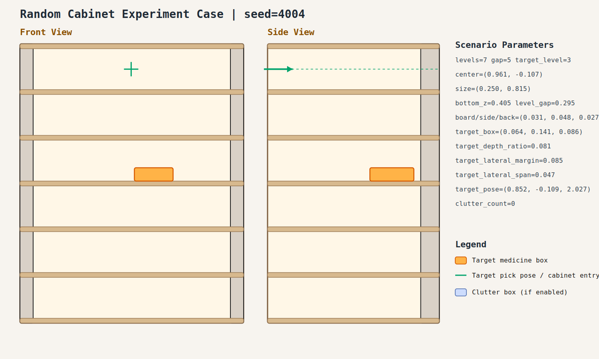

# case_004

## Result

- Success: `True`
- Final stage: `COMPLETED`

## Parameters

- Seed: `4004`
- Shelf levels: `7`
- Target gap index: `5`
- Target level: `3`
- Shelf center: `(0.961, -0.107)`
- Shelf size (depth,width): `(0.250, 0.815)`
- Shelf bottom / level gap: `(0.405, 0.295)`
- Shelf board / side / back thickness: `(0.031, 0.048, 0.027)`
- Target box size: `(0.064, 0.141, 0.086)`
- Target pose: `(0.852, -0.109, 2.027)`

## Stage Durations

- `ACQUIRE_TARGET`: 0.087s
- `ARM_STOW_SAFE`: 0.321s
- `BASE_ENTER_WORKSPACE`: 2.714s
- `LIFT_TO_BAND`: 2.212s
- `SELECT_PRE_INSERT`: 0.003s
- `PLAN_TO_PRE_INSERT`: 2.200s
- `INSERT_AND_SUCTION`: 0.645s
- `SAFE_RETREAT`: 3.317s

## Video

- No video metadata was generated for this case.

## Files

- `scene.svg`: cabinet image
- `params.json`: generated cabinet parameters
- `result.json`: parsed experiment result
- `run.log`: raw ROS/MoveIt log
