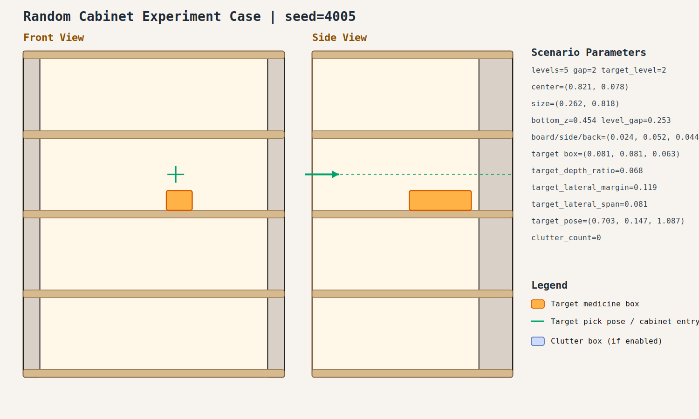

# case_005

## Result

- Success: `True`
- Final stage: `COMPLETED`

## Parameters

- Seed: `4005`
- Shelf levels: `5`
- Target gap index: `2`
- Target level: `2`
- Shelf center: `(0.821, 0.078)`
- Shelf size (depth,width): `(0.262, 0.818)`
- Shelf bottom / level gap: `(0.454, 0.253)`
- Shelf board / side / back thickness: `(0.024, 0.052, 0.044)`
- Target box size: `(0.081, 0.081, 0.063)`
- Target pose: `(0.703, 0.147, 1.087)`

## Stage Durations

- `ACQUIRE_TARGET`: 0.623s
- `ARM_STOW_SAFE`: 2.307s
- `BASE_ENTER_WORKSPACE`: 2.709s
- `LIFT_TO_BAND`: 0.255s
- `SELECT_PRE_INSERT`: 0.005s
- `PLAN_TO_PRE_INSERT`: 1.546s
- `INSERT_AND_SUCTION`: 0.616s
- `SAFE_RETREAT`: 3.283s

## Video

- No video metadata was generated for this case.

## Files

- `scene.svg`: cabinet image
- `params.json`: generated cabinet parameters
- `result.json`: parsed experiment result
- `run.log`: raw ROS/MoveIt log
