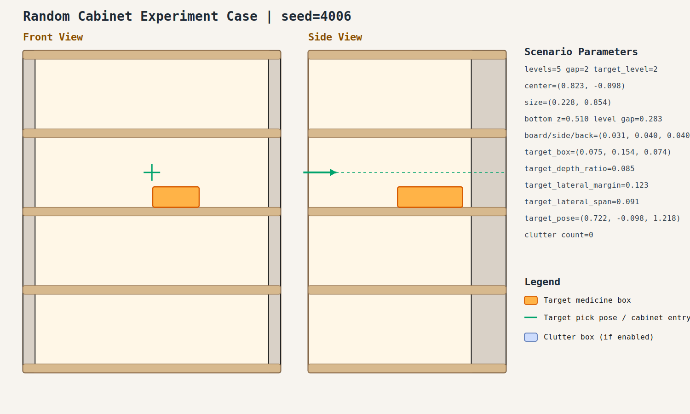

# case_006

## Result

- Success: `True`
- Final stage: `COMPLETED`

## Parameters

- Seed: `4006`
- Shelf levels: `5`
- Target gap index: `2`
- Target level: `2`
- Shelf center: `(0.823, -0.098)`
- Shelf size (depth,width): `(0.228, 0.854)`
- Shelf bottom / level gap: `(0.510, 0.283)`
- Shelf board / side / back thickness: `(0.031, 0.040, 0.040)`
- Target box size: `(0.075, 0.154, 0.074)`
- Target pose: `(0.722, -0.098, 1.218)`

## Stage Durations

- `ACQUIRE_TARGET`: 0.037s
- `ARM_STOW_SAFE`: 2.301s
- `BASE_ENTER_WORKSPACE`: 2.713s
- `LIFT_TO_BAND`: 2.210s
- `SELECT_PRE_INSERT`: 0.004s
- `PLAN_TO_PRE_INSERT`: 1.582s
- `INSERT_AND_SUCTION`: 0.619s
- `SAFE_RETREAT`: 1.125s

## Video

- No video metadata was generated for this case.

## Files

- `scene.svg`: cabinet image
- `params.json`: generated cabinet parameters
- `result.json`: parsed experiment result
- `run.log`: raw ROS/MoveIt log
