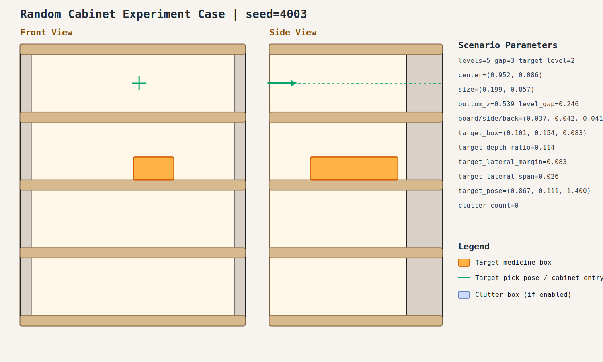

# case_003

## Result

- Success: `True`
- Final stage: `COMPLETED`

## Parameters

- Seed: `4003`
- Shelf levels: `5`
- Target gap index: `3`
- Target level: `2`
- Shelf center: `(0.952, 0.086)`
- Shelf size (depth,width): `(0.199, 0.857)`
- Shelf bottom / level gap: `(0.539, 0.246)`
- Shelf board / side / back thickness: `(0.037, 0.042, 0.041)`
- Target box size: `(0.101, 0.154, 0.083)`
- Target pose: `(0.867, 0.111, 1.400)`

## Stage Durations

- `ACQUIRE_TARGET`: 0.646s
- `ARM_STOW_SAFE`: 2.320s
- `BASE_ENTER_WORKSPACE`: 2.713s
- `LIFT_TO_BAND`: 2.217s
- `SELECT_PRE_INSERT`: 0.003s
- `PLAN_TO_PRE_INSERT`: 1.566s
- `INSERT_AND_SUCTION`: 0.628s
- `SAFE_RETREAT`: 3.252s

## Video

- No video metadata was generated for this case.

## Files

- `scene.svg`: cabinet image
- `params.json`: generated cabinet parameters
- `result.json`: parsed experiment result
- `run.log`: raw ROS/MoveIt log
