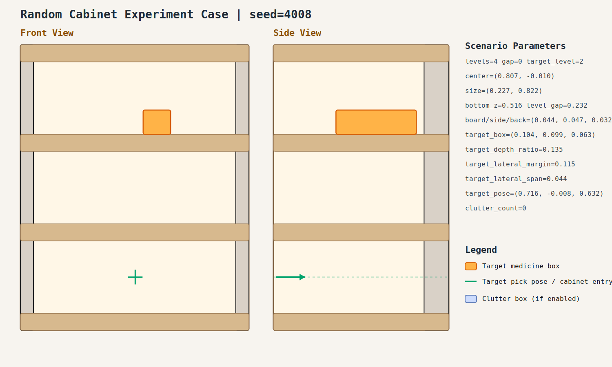

# Random Cabinet Experiment Record: 20260408_222855_random_cabinet_experiment

- Total cases: `2`
- Successful cases: `0`
- Success ratio: `0.0%`
- Failure analysis: [analysis.md](./analysis.md)

## Cases

### case_001

- Seed: `4007`
- Success: `False`
- Final stage: `FAILED`
- Shelf size (depth,width): `(0.202, 0.675)`
- Shelf center: `(0.968, 0.070)`
- Shelf bottom / level gap: `(0.475, 0.299)`
- Target box size: `(0.064, 0.152, 0.055)`
- Video recorded: `False`
- Failure message: `Pre-insert planning failed: MoveIt failed to produce a valid trajectory (INVALID_MOTION_PLAN, code=-2).; retry failed: MoveIt failed to produce a valid trajectory (INVALID_MOTION_PLAN, code=-2).`
- Stage durations:
- `ACQUIRE_TARGET`: 1.669s
- `ARM_STOW_SAFE`: 2.211s
- `BASE_ENTER_WORKSPACE`: 2.711s
- `LIFT_TO_BAND`: 2.211s
- `SELECT_PRE_INSERT`: 0.027s
- `PLAN_TO_PRE_INSERT`: 1.086s
- Detailed record: [README.md](./case_001/README.md)

### case_002

- Seed: `4008`
- Success: `False`
- Final stage: `FAILED`
- Shelf size (depth,width): `(0.227, 0.822)`
- Shelf center: `(0.807, -0.010)`
- Shelf bottom / level gap: `(0.516, 0.232)`
- Target box size: `(0.104, 0.099, 0.063)`
- Video recorded: `False`
- Failure message: `Pre-insert planning failed: MoveIt failed to produce a valid trajectory (TIMED_OUT, code=-6).; retry failed: MoveIt failed to produce a valid trajectory (FAILURE, code=99999).`
- Stage durations:
- `ACQUIRE_TARGET`: 0.874s
- `ARM_STOW_SAFE`: 2.305s
- `BASE_ENTER_WORKSPACE`: 2.712s
- `LIFT_TO_BAND`: 2.209s
- `SELECT_PRE_INSERT`: 0.024s
- `PLAN_TO_PRE_INSERT`: 5.110s
- Detailed record: [README.md](./case_002/README.md)
