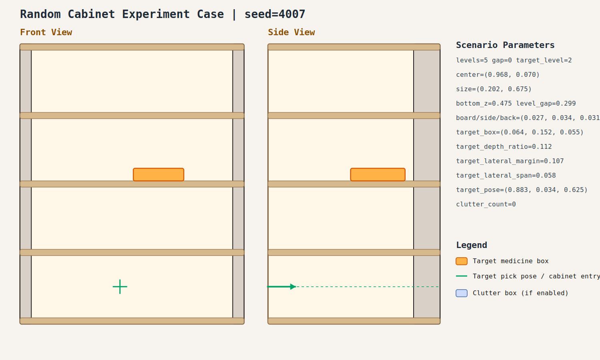

# Random Cabinet Experiment Record: 20260408_223512_random_cabinet_experiment

- Total cases: `2`
- Successful cases: `0`
- Success ratio: `0.0%`
- Failure analysis: [analysis.md](./analysis.md)

## Cases

### case_001

- Seed: `4007`
- Success: `False`
- Final stage: `FAILED`
- Shelf size (depth,width): `(0.202, 0.675)`
- Shelf center: `(0.968, 0.070)`
- Shelf bottom / level gap: `(0.475, 0.299)`
- Target box size: `(0.064, 0.152, 0.055)`
- Video recorded: `False`
- Failure message: `Pre-insert trajectory violates the R1 stage-motion limit.`
- Stage durations:
- `ACQUIRE_TARGET`: 0.693s
- `ARM_STOW_SAFE`: 2.299s
- `BASE_ENTER_WORKSPACE`: 2.710s
- `LIFT_TO_BAND`: 2.208s
- `SELECT_PRE_INSERT`: 0.023s
- `PLAN_TO_PRE_INSERT`: 4.008s
- Detailed record: [README.md](./case_001/README.md)

### case_002

- Seed: `4008`
- Success: `False`
- Final stage: `INSERT_AND_SUCTION`
- Shelf size (depth,width): `(0.227, 0.822)`
- Shelf center: `(0.807, -0.010)`
- Shelf bottom / level gap: `(0.516, 0.232)`
- Target box size: `(0.104, 0.099, 0.063)`
- Video recorded: `False`
- Failure message: `N/A`
- Stage durations:
- `ACQUIRE_TARGET`: 0.609s
- `ARM_STOW_SAFE`: 2.303s
- `BASE_ENTER_WORKSPACE`: 2.713s
- `LIFT_TO_BAND`: 2.213s
- `SELECT_PRE_INSERT`: 0.022s
- `PLAN_TO_PRE_INSERT`: 15.148s
- `INSERT_AND_SUCTION`: 5.392s
- `SELECT_PRE_INSERT`: 0.026s
- `PLAN_TO_PRE_INSERT`: 1.453s
- `INSERT_AND_SUCTION`: 5.461s
- `SELECT_PRE_INSERT`: 0.023s
- `PLAN_TO_PRE_INSERT`: 1.495s
- `INSERT_AND_SUCTION`: 5.394s
- `SELECT_PRE_INSERT`: 0.022s
- `PLAN_TO_PRE_INSERT`: 1.474s
- `INSERT_AND_SUCTION`: 5.355s
- `SELECT_PRE_INSERT`: 0.022s
- `PLAN_TO_PRE_INSERT`: 1.524s
- Detailed record: [README.md](./case_002/README.md)
