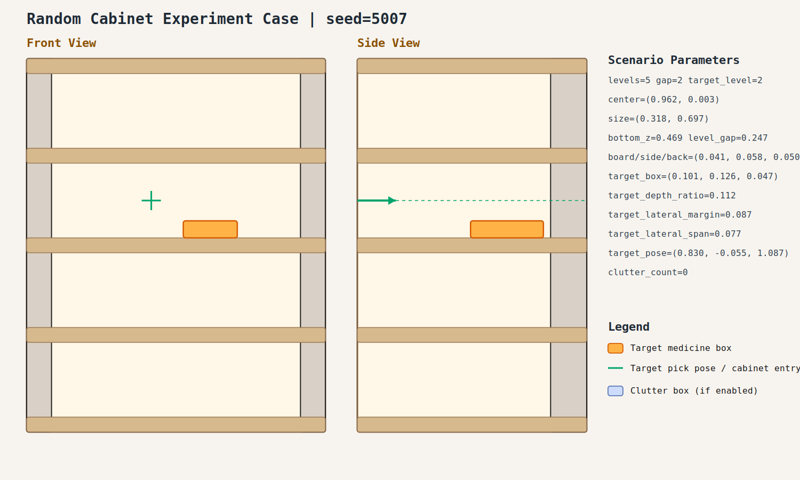

# Random Cabinet Experiment Record: 20260408_233906_random_cabinet_experiment

- Total cases: `10`
- Successful cases: `7`
- Success ratio: `70.0%`
- Failure analysis: [analysis.md](./analysis.md)

## Cases

### case_001

- Seed: `5001`
- Success: `True`
- Final stage: `COMPLETED`
- Shelf size (depth,width): `(0.283, 0.794)`
- Shelf center: `(0.902, -0.091)`
- Shelf bottom / level gap: `(0.423, 0.253)`
- Target box size: `(0.094, 0.152, 0.071)`
- Video recorded: `False`
- Failure message: `N/A`
- Stage durations:
- `ACQUIRE_TARGET`: 1.493s
- `ARM_STOW_SAFE`: 2.298s
- `BASE_ENTER_WORKSPACE`: 2.718s
- `LIFT_TO_BAND`: 2.210s
- `SELECT_PRE_INSERT`: 0.026s
- `PLAN_TO_PRE_INSERT`: 1.650s
- `INSERT_AND_SUCTION`: 0.644s
- `SAFE_RETREAT`: 3.237s
- Detailed record: [README.md](./case_001/README.md)

### case_002

- Seed: `5002`
- Success: `True`
- Final stage: `COMPLETED`
- Shelf size (depth,width): `(0.185, 0.875)`
- Shelf center: `(0.937, 0.052)`
- Shelf bottom / level gap: `(0.481, 0.220)`
- Target box size: `(0.089, 0.150, 0.075)`
- Video recorded: `False`
- Failure message: `N/A`
- Stage durations:
- `ACQUIRE_TARGET`: 1.901s
- `ARM_STOW_SAFE`: 2.308s
- `BASE_ENTER_WORKSPACE`: 2.713s
- `LIFT_TO_BAND`: 2.209s
- `SELECT_PRE_INSERT`: 0.019s
- `PLAN_TO_PRE_INSERT`: 1.580s
- `INSERT_AND_SUCTION`: 0.609s
- `SAFE_RETREAT`: 3.263s
- Detailed record: [README.md](./case_002/README.md)

### case_003

- Seed: `5003`
- Success: `False`
- Final stage: `FAILED`
- Shelf size (depth,width): `(0.237, 0.841)`
- Shelf center: `(0.896, 0.018)`
- Shelf bottom / level gap: `(0.507, 0.238)`
- Target box size: `(0.079, 0.157, 0.073)`
- Video recorded: `False`
- Failure message: `Retreat trajectory violates the R1 reasonable-angle limit.`
- Stage durations:
- `ACQUIRE_TARGET`: 0.662s
- `ARM_STOW_SAFE`: 2.299s
- `BASE_ENTER_WORKSPACE`: 2.713s
- `LIFT_TO_BAND`: 2.211s
- `SELECT_PRE_INSERT`: 0.024s
- `PLAN_TO_PRE_INSERT`: 11.537s
- `INSERT_AND_SUCTION`: 0.572s
- `SAFE_RETREAT`: 0.031s
- Detailed record: [README.md](./case_003/README.md)

### case_004

- Seed: `5004`
- Success: `False`
- Final stage: `FAILED`
- Shelf size (depth,width): `(0.227, 0.885)`
- Shelf center: `(0.905, -0.003)`
- Shelf bottom / level gap: `(0.411, 0.262)`
- Target box size: `(0.105, 0.111, 0.094)`
- Video recorded: `False`
- Failure message: `Pre-insert planning failed: MoveIt failed to produce a valid trajectory (TIMED_OUT, code=-6).; retry failed: MoveIt failed to produce a valid trajectory (INVALID_MOTION_PLAN, code=-2).`
- Stage durations:
- `ACQUIRE_TARGET`: 0.000s
- `ARM_STOW_SAFE`: 5.810s
- `BASE_ENTER_WORKSPACE`: 2.717s
- `LIFT_TO_BAND`: 2.215s
- `SELECT_PRE_INSERT`: 0.023s
- `PLAN_TO_PRE_INSERT`: 15.351s
- Detailed record: [README.md](./case_004/README.md)

### case_005

- Seed: `5005`
- Success: `True`
- Final stage: `COMPLETED`
- Shelf size (depth,width): `(0.210, 0.644)`
- Shelf center: `(0.887, -0.055)`
- Shelf bottom / level gap: `(0.416, 0.198)`
- Target box size: `(0.059, 0.096, 0.090)`
- Video recorded: `False`
- Failure message: `N/A`
- Stage durations:
- `ACQUIRE_TARGET`: 0.641s
- `ARM_STOW_SAFE`: 2.305s
- `BASE_ENTER_WORKSPACE`: 2.716s
- `LIFT_TO_BAND`: 2.209s
- `SELECT_PRE_INSERT`: 0.023s
- `PLAN_TO_PRE_INSERT`: 1.577s
- `INSERT_AND_SUCTION`: 0.613s
- `SAFE_RETREAT`: 3.259s
- Detailed record: [README.md](./case_005/README.md)

### case_006

- Seed: `5006`
- Success: `True`
- Final stage: `COMPLETED`
- Shelf size (depth,width): `(0.276, 0.920)`
- Shelf center: `(0.931, -0.100)`
- Shelf bottom / level gap: `(0.493, 0.208)`
- Target box size: `(0.098, 0.120, 0.063)`
- Video recorded: `False`
- Failure message: `N/A`
- Stage durations:
- `ACQUIRE_TARGET`: 0.610s
- `ARM_STOW_SAFE`: 2.302s
- `BASE_ENTER_WORKSPACE`: 2.711s
- `LIFT_TO_BAND`: 2.214s
- `SELECT_PRE_INSERT`: 0.023s
- `PLAN_TO_PRE_INSERT`: 1.569s
- `INSERT_AND_SUCTION`: 0.655s
- `SAFE_RETREAT`: 3.282s
- Detailed record: [README.md](./case_006/README.md)

### case_007

- Seed: `5007`
- Success: `True`
- Final stage: `COMPLETED`
- Shelf size (depth,width): `(0.318, 0.697)`
- Shelf center: `(0.962, 0.003)`
- Shelf bottom / level gap: `(0.469, 0.247)`
- Target box size: `(0.101, 0.126, 0.047)`
- Video recorded: `False`
- Failure message: `N/A`
- Stage durations:
- `ACQUIRE_TARGET`: 1.611s
- `ARM_STOW_SAFE`: 2.217s
- `BASE_ENTER_WORKSPACE`: 2.709s
- `LIFT_TO_BAND`: 2.210s
- `SELECT_PRE_INSERT`: 0.023s
- `PLAN_TO_PRE_INSERT`: 1.548s
- `INSERT_AND_SUCTION`: 0.670s
- `SAFE_RETREAT`: 3.270s
- Detailed record: [README.md](./case_007/README.md)

### case_008

- Seed: `5008`
- Success: `False`
- Final stage: `FAILED`
- Shelf size (depth,width): `(0.282, 0.778)`
- Shelf center: `(0.843, 0.090)`
- Shelf bottom / level gap: `(0.402, 0.234)`
- Target box size: `(0.080, 0.101, 0.054)`
- Video recorded: `False`
- Failure message: `Pre-insert planning failed: MoveIt failed to produce a valid trajectory (INVALID_MOTION_PLAN, code=-2).; retry failed: MoveIt failed to produce a valid trajectory (FAILURE, code=99999).`
- Stage durations:
- `ACQUIRE_TARGET`: 0.644s
- `ARM_STOW_SAFE`: 2.305s
- `BASE_ENTER_WORKSPACE`: 0.216s
- `LIFT_TO_BAND`: 2.209s
- `SELECT_PRE_INSERT`: 0.022s
- `PLAN_TO_PRE_INSERT`: 14.674s
- Detailed record: [README.md](./case_008/README.md)

### case_009

- Seed: `5009`
- Success: `True`
- Final stage: `COMPLETED`
- Shelf size (depth,width): `(0.284, 0.822)`
- Shelf center: `(0.896, -0.073)`
- Shelf bottom / level gap: `(0.446, 0.269)`
- Target box size: `(0.075, 0.084, 0.079)`
- Video recorded: `False`
- Failure message: `N/A`
- Stage durations:
- `ACQUIRE_TARGET`: 0.662s
- `ARM_STOW_SAFE`: 2.305s
- `BASE_ENTER_WORKSPACE`: 2.713s
- `LIFT_TO_BAND`: 0.000s
- `SELECT_PRE_INSERT`: 0.365s
- `PLAN_TO_PRE_INSERT`: 2.016s
- `INSERT_AND_SUCTION`: 0.665s
- `SAFE_RETREAT`: 3.232s
- Detailed record: [README.md](./case_009/README.md)

### case_010

- Seed: `5010`
- Success: `True`
- Final stage: `COMPLETED`
- Shelf size (depth,width): `(0.319, 0.583)`
- Shelf center: `(0.916, 0.089)`
- Shelf bottom / level gap: `(0.503, 0.276)`
- Target box size: `(0.104, 0.090, 0.078)`
- Video recorded: `False`
- Failure message: `N/A`
- Stage durations:
- `ACQUIRE_TARGET`: 0.671s
- `ARM_STOW_SAFE`: 2.305s
- `BASE_ENTER_WORKSPACE`: 2.719s
- `LIFT_TO_BAND`: 2.210s
- `SELECT_PRE_INSERT`: 0.026s
- `PLAN_TO_PRE_INSERT`: 1.885s
- `INSERT_AND_SUCTION`: 0.677s
- `SAFE_RETREAT`: 2.566s
- Detailed record: [README.md](./case_010/README.md)
