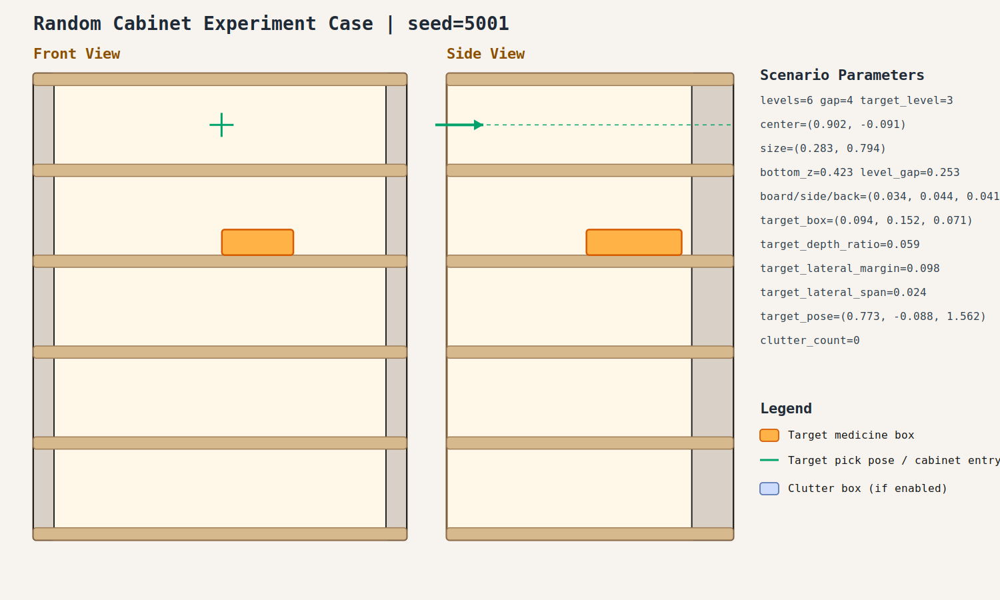

# case_001

## Result

- Success: `True`
- Final stage: `COMPLETED`

## Parameters

- Seed: `5001`
- Shelf levels: `6`
- Target gap index: `4`
- Target level: `3`
- Shelf center: `(0.902, -0.091)`
- Shelf size (depth,width): `(0.283, 0.794)`
- Shelf bottom / level gap: `(0.423, 0.253)`
- Shelf board / side / back thickness: `(0.034, 0.044, 0.041)`
- Target box size: `(0.094, 0.152, 0.071)`
- Target pose: `(0.773, -0.088, 1.562)`

## Stage Durations

- `ACQUIRE_TARGET`: 1.493s
- `ARM_STOW_SAFE`: 2.298s
- `BASE_ENTER_WORKSPACE`: 2.718s
- `LIFT_TO_BAND`: 2.210s
- `SELECT_PRE_INSERT`: 0.026s
- `PLAN_TO_PRE_INSERT`: 1.650s
- `INSERT_AND_SUCTION`: 0.644s
- `SAFE_RETREAT`: 3.237s

## Video

- No video metadata was generated for this case.

## Files

- `scene.svg`: cabinet image
- `params.json`: generated cabinet parameters
- `result.json`: parsed experiment result
- `run.log`: raw ROS/MoveIt log
