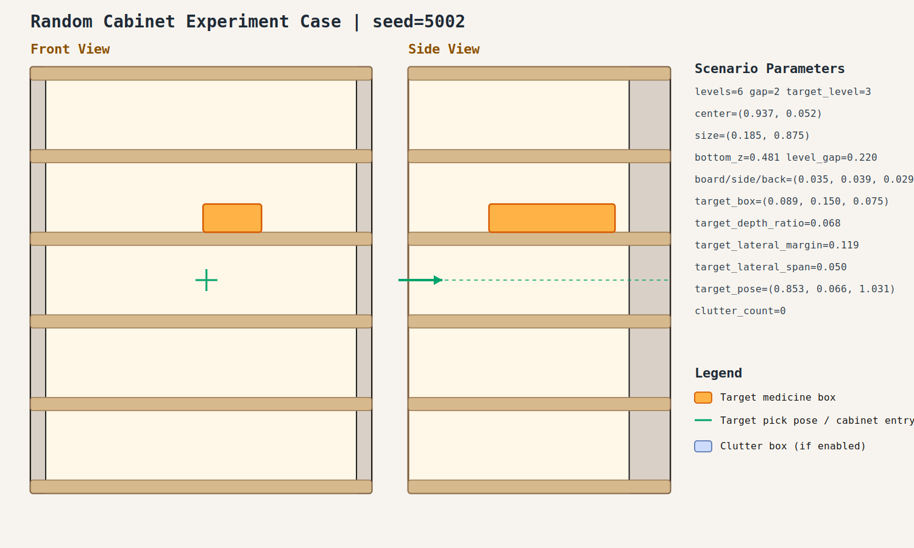

# case_002

## Result

- Success: `True`
- Final stage: `COMPLETED`

## Parameters

- Seed: `5002`
- Shelf levels: `6`
- Target gap index: `2`
- Target level: `3`
- Shelf center: `(0.937, 0.052)`
- Shelf size (depth,width): `(0.185, 0.875)`
- Shelf bottom / level gap: `(0.481, 0.220)`
- Shelf board / side / back thickness: `(0.035, 0.039, 0.029)`
- Target box size: `(0.089, 0.150, 0.075)`
- Target pose: `(0.853, 0.066, 1.031)`

## Stage Durations

- `ACQUIRE_TARGET`: 1.901s
- `ARM_STOW_SAFE`: 2.308s
- `BASE_ENTER_WORKSPACE`: 2.713s
- `LIFT_TO_BAND`: 2.209s
- `SELECT_PRE_INSERT`: 0.019s
- `PLAN_TO_PRE_INSERT`: 1.580s
- `INSERT_AND_SUCTION`: 0.609s
- `SAFE_RETREAT`: 3.263s

## Video

- No video metadata was generated for this case.

## Files

- `scene.svg`: cabinet image
- `params.json`: generated cabinet parameters
- `result.json`: parsed experiment result
- `run.log`: raw ROS/MoveIt log
