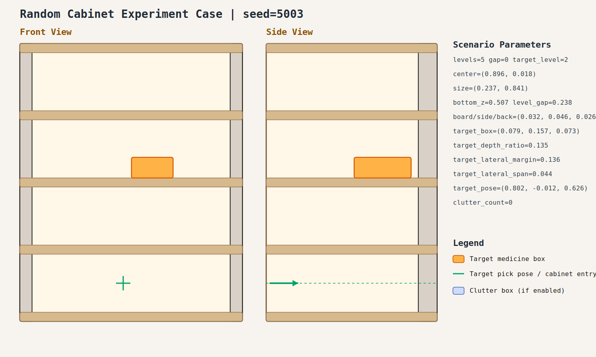

# case_003

## Result

- Success: `False`
- Final stage: `FAILED`
- Failure message: `Retreat trajectory violates the R1 reasonable-angle limit.`

## Parameters

- Seed: `5003`
- Shelf levels: `5`
- Target gap index: `0`
- Target level: `2`
- Shelf center: `(0.896, 0.018)`
- Shelf size (depth,width): `(0.237, 0.841)`
- Shelf bottom / level gap: `(0.507, 0.238)`
- Shelf board / side / back thickness: `(0.032, 0.046, 0.026)`
- Target box size: `(0.079, 0.157, 0.073)`
- Target pose: `(0.802, -0.012, 0.626)`

## Stage Durations

- `ACQUIRE_TARGET`: 0.662s
- `ARM_STOW_SAFE`: 2.299s
- `BASE_ENTER_WORKSPACE`: 2.713s
- `LIFT_TO_BAND`: 2.211s
- `SELECT_PRE_INSERT`: 0.024s
- `PLAN_TO_PRE_INSERT`: 11.537s
- `INSERT_AND_SUCTION`: 0.572s
- `SAFE_RETREAT`: 0.031s

## Video

- No video metadata was generated for this case.

## Files

- `scene.svg`: cabinet image
- `params.json`: generated cabinet parameters
- `result.json`: parsed experiment result
- `run.log`: raw ROS/MoveIt log
