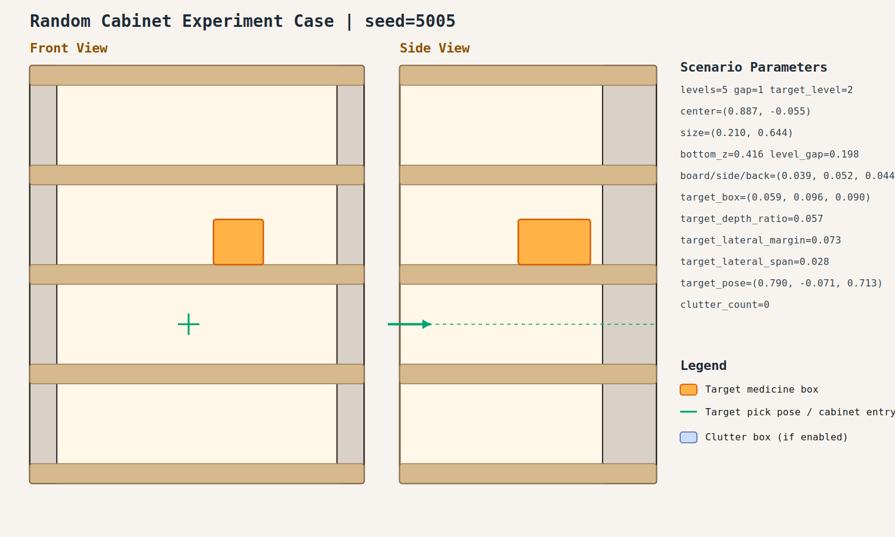

# case_005

## Result

- Success: `True`
- Final stage: `COMPLETED`

## Parameters

- Seed: `5005`
- Shelf levels: `5`
- Target gap index: `1`
- Target level: `2`
- Shelf center: `(0.887, -0.055)`
- Shelf size (depth,width): `(0.210, 0.644)`
- Shelf bottom / level gap: `(0.416, 0.198)`
- Shelf board / side / back thickness: `(0.039, 0.052, 0.044)`
- Target box size: `(0.059, 0.096, 0.090)`
- Target pose: `(0.790, -0.071, 0.713)`

## Stage Durations

- `ACQUIRE_TARGET`: 0.641s
- `ARM_STOW_SAFE`: 2.305s
- `BASE_ENTER_WORKSPACE`: 2.716s
- `LIFT_TO_BAND`: 2.209s
- `SELECT_PRE_INSERT`: 0.023s
- `PLAN_TO_PRE_INSERT`: 1.577s
- `INSERT_AND_SUCTION`: 0.613s
- `SAFE_RETREAT`: 3.259s

## Video

- No video metadata was generated for this case.

## Files

- `scene.svg`: cabinet image
- `params.json`: generated cabinet parameters
- `result.json`: parsed experiment result
- `run.log`: raw ROS/MoveIt log
