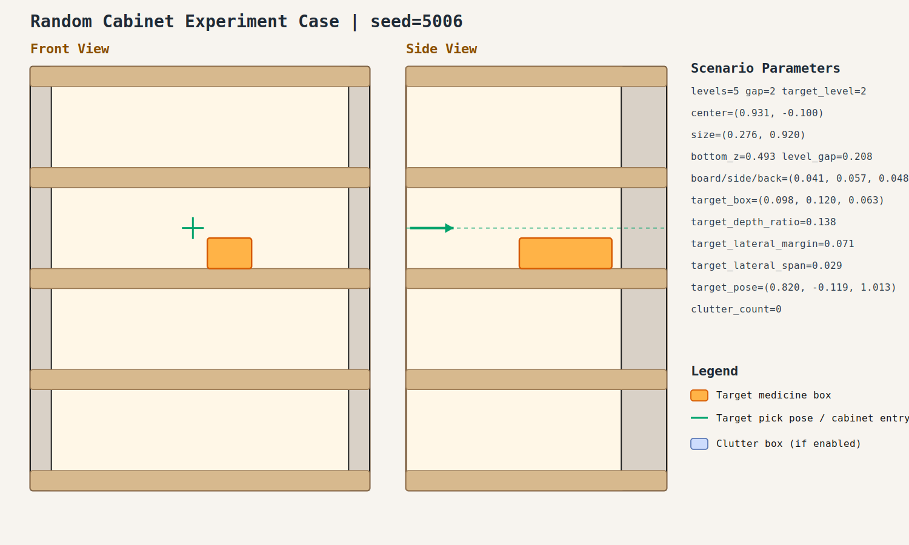

# case_006

## Result

- Success: `True`
- Final stage: `COMPLETED`

## Parameters

- Seed: `5006`
- Shelf levels: `5`
- Target gap index: `2`
- Target level: `2`
- Shelf center: `(0.931, -0.100)`
- Shelf size (depth,width): `(0.276, 0.920)`
- Shelf bottom / level gap: `(0.493, 0.208)`
- Shelf board / side / back thickness: `(0.041, 0.057, 0.048)`
- Target box size: `(0.098, 0.120, 0.063)`
- Target pose: `(0.820, -0.119, 1.013)`

## Stage Durations

- `ACQUIRE_TARGET`: 0.610s
- `ARM_STOW_SAFE`: 2.302s
- `BASE_ENTER_WORKSPACE`: 2.711s
- `LIFT_TO_BAND`: 2.214s
- `SELECT_PRE_INSERT`: 0.023s
- `PLAN_TO_PRE_INSERT`: 1.569s
- `INSERT_AND_SUCTION`: 0.655s
- `SAFE_RETREAT`: 3.282s

## Video

- No video metadata was generated for this case.

## Files

- `scene.svg`: cabinet image
- `params.json`: generated cabinet parameters
- `result.json`: parsed experiment result
- `run.log`: raw ROS/MoveIt log
