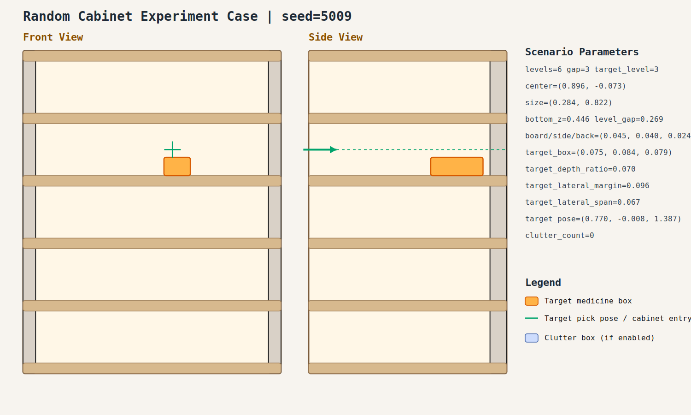

# case_009

## Result

- Success: `True`
- Final stage: `COMPLETED`

## Parameters

- Seed: `5009`
- Shelf levels: `6`
- Target gap index: `3`
- Target level: `3`
- Shelf center: `(0.896, -0.073)`
- Shelf size (depth,width): `(0.284, 0.822)`
- Shelf bottom / level gap: `(0.446, 0.269)`
- Shelf board / side / back thickness: `(0.045, 0.040, 0.024)`
- Target box size: `(0.075, 0.084, 0.079)`
- Target pose: `(0.770, -0.008, 1.387)`

## Stage Durations

- `ACQUIRE_TARGET`: 0.662s
- `ARM_STOW_SAFE`: 2.305s
- `BASE_ENTER_WORKSPACE`: 2.713s
- `LIFT_TO_BAND`: 0.000s
- `SELECT_PRE_INSERT`: 0.365s
- `PLAN_TO_PRE_INSERT`: 2.016s
- `INSERT_AND_SUCTION`: 0.665s
- `SAFE_RETREAT`: 3.232s

## Video

- No video metadata was generated for this case.

## Files

- `scene.svg`: cabinet image
- `params.json`: generated cabinet parameters
- `result.json`: parsed experiment result
- `run.log`: raw ROS/MoveIt log
