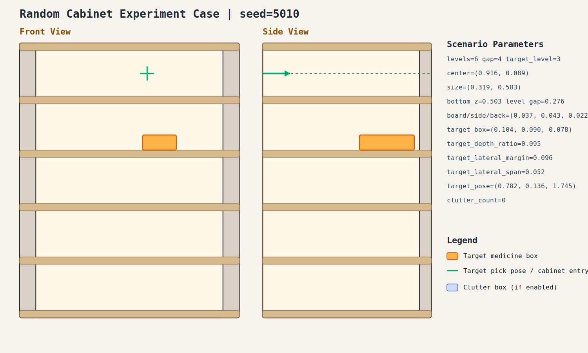

# case_010

## Result

- Success: `True`
- Final stage: `COMPLETED`

## Parameters

- Seed: `5010`
- Shelf levels: `6`
- Target gap index: `4`
- Target level: `3`
- Shelf center: `(0.916, 0.089)`
- Shelf size (depth,width): `(0.319, 0.583)`
- Shelf bottom / level gap: `(0.503, 0.276)`
- Shelf board / side / back thickness: `(0.037, 0.043, 0.022)`
- Target box size: `(0.104, 0.090, 0.078)`
- Target pose: `(0.782, 0.136, 1.745)`

## Stage Durations

- `ACQUIRE_TARGET`: 0.671s
- `ARM_STOW_SAFE`: 2.305s
- `BASE_ENTER_WORKSPACE`: 2.719s
- `LIFT_TO_BAND`: 2.210s
- `SELECT_PRE_INSERT`: 0.026s
- `PLAN_TO_PRE_INSERT`: 1.885s
- `INSERT_AND_SUCTION`: 0.677s
- `SAFE_RETREAT`: 2.566s

## Video

- No video metadata was generated for this case.

## Files

- `scene.svg`: cabinet image
- `params.json`: generated cabinet parameters
- `result.json`: parsed experiment result
- `run.log`: raw ROS/MoveIt log
