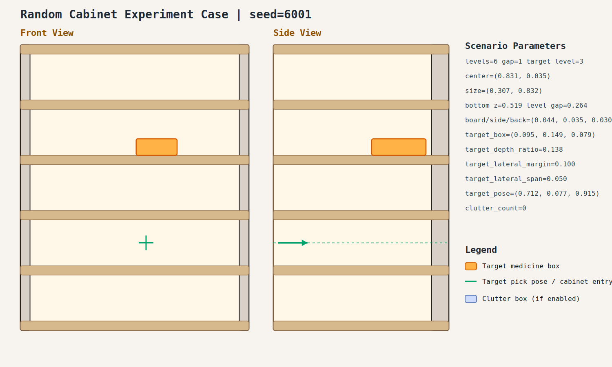
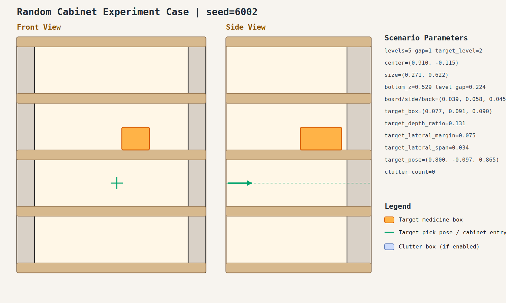
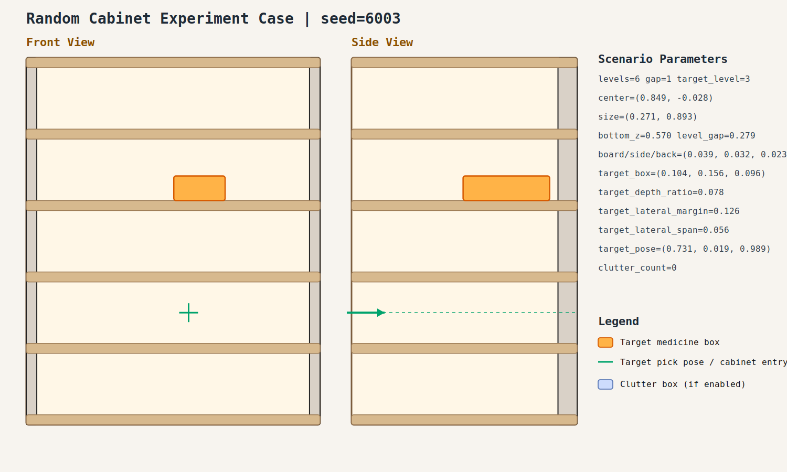
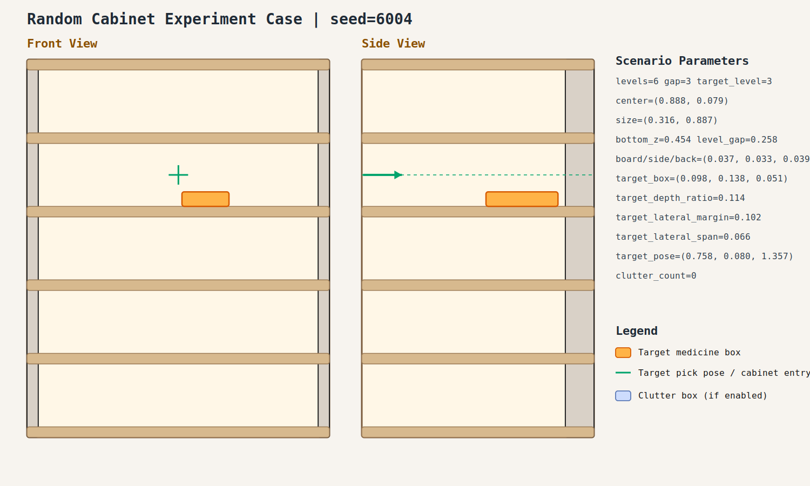
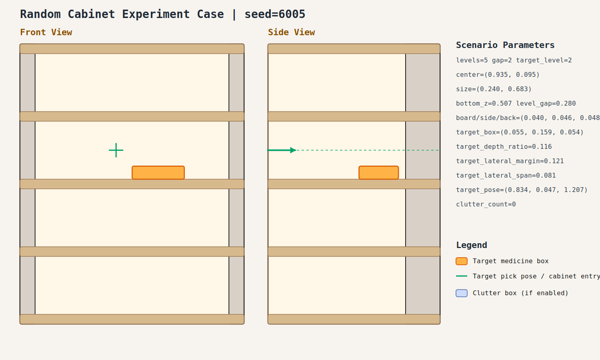
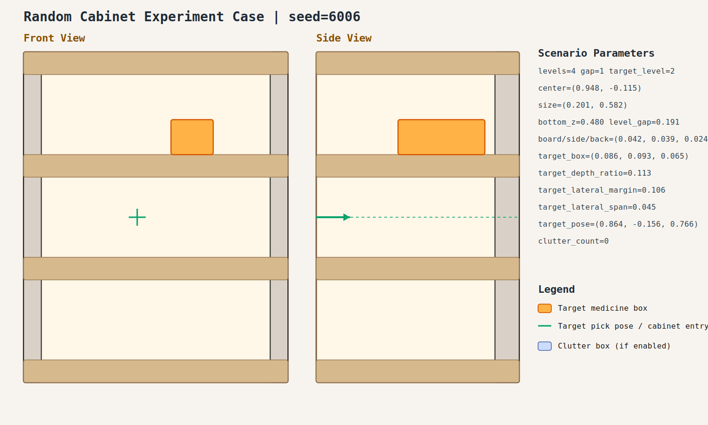
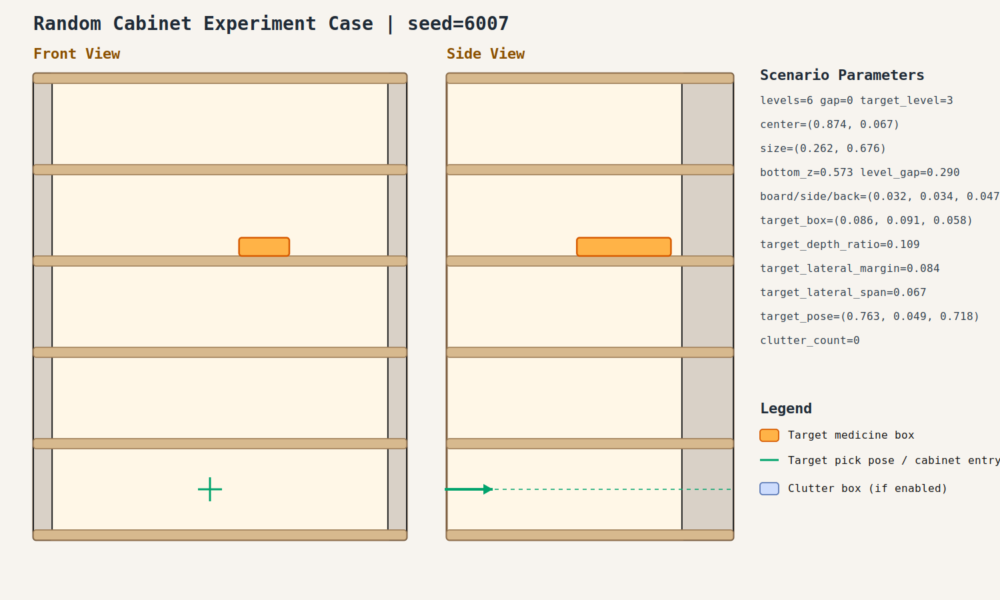
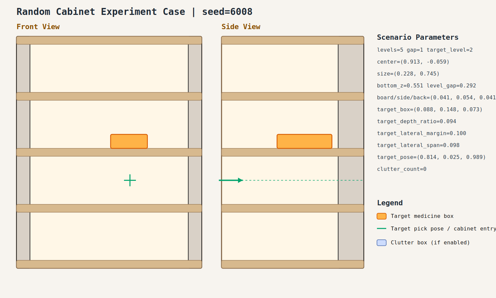
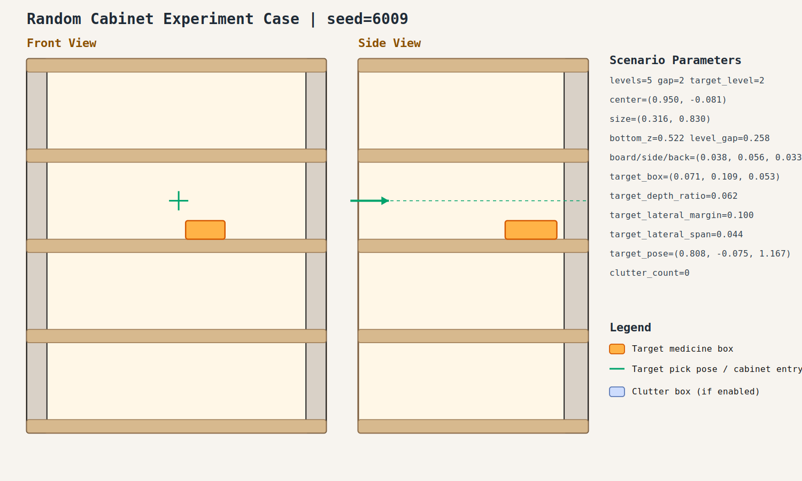
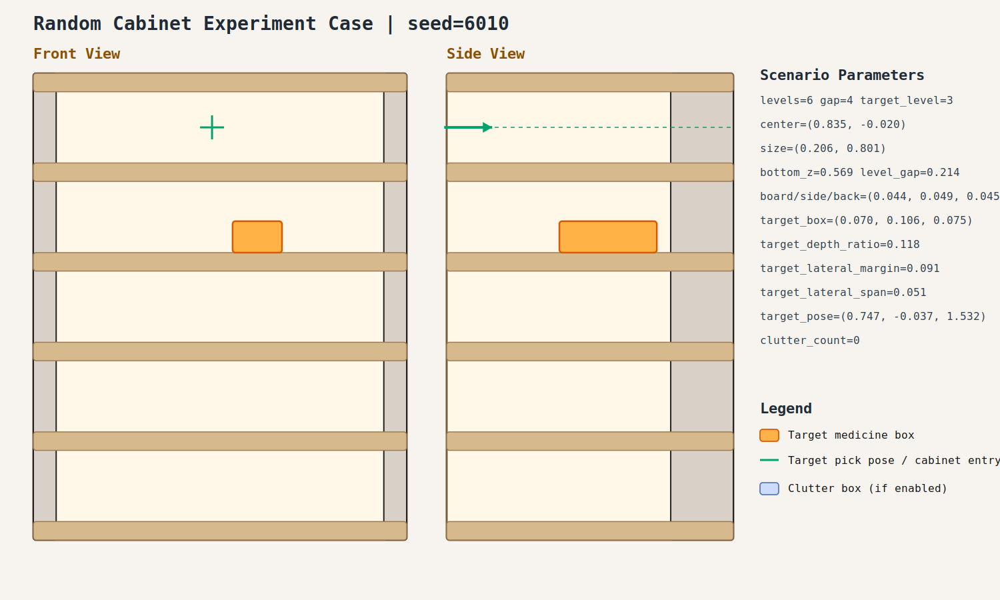

# Random Cabinet Experiment Record: 20260409_000747_random_cabinet_experiment

- Total cases: `10`
- Successful cases: `10`
- Success ratio: `100.0%`
- Failure analysis: [analysis.md](./analysis.md)

## Cases

### case_001

- Seed: `6001`
- Success: `True`
- Final stage: `COMPLETED`
- Shelf size (depth,width): `(0.307, 0.832)`
- Shelf center: `(0.831, 0.035)`
- Shelf bottom / level gap: `(0.519, 0.264)`
- Target box size: `(0.095, 0.149, 0.079)`
- Video recorded: `False`
- Failure message: `N/A`
- Stage durations:
- `ACQUIRE_TARGET`: 0.683s
- `ARM_STOW_SAFE`: 2.291s
- `BASE_ENTER_WORKSPACE`: 2.714s
- `LIFT_TO_BAND`: 2.214s
- `SELECT_PRE_INSERT`: 0.047s
- `PLAN_TO_PRE_INSERT`: 1.532s
- `INSERT_AND_SUCTION`: 0.685s
- `SAFE_RETREAT`: 3.285s
- Detailed record: [README.md](./case_001/README.md)

### case_002

- Seed: `6002`
- Success: `True`
- Final stage: `COMPLETED`
- Shelf size (depth,width): `(0.271, 0.622)`
- Shelf center: `(0.910, -0.115)`
- Shelf bottom / level gap: `(0.529, 0.224)`
- Target box size: `(0.077, 0.091, 0.090)`
- Video recorded: `False`
- Failure message: `N/A`
- Stage durations:
- `ACQUIRE_TARGET`: 0.680s
- `ARM_STOW_SAFE`: 2.303s
- `BASE_ENTER_WORKSPACE`: 2.716s
- `LIFT_TO_BAND`: 2.219s
- `SELECT_PRE_INSERT`: 0.026s
- `PLAN_TO_PRE_INSERT`: 1.557s
- `INSERT_AND_SUCTION`: 0.658s
- `SAFE_RETREAT`: 3.286s
- Detailed record: [README.md](./case_002/README.md)

### case_003

- Seed: `6003`
- Success: `True`
- Final stage: `COMPLETED`
- Shelf size (depth,width): `(0.271, 0.893)`
- Shelf center: `(0.849, -0.028)`
- Shelf bottom / level gap: `(0.570, 0.279)`
- Target box size: `(0.104, 0.156, 0.096)`
- Video recorded: `False`
- Failure message: `N/A`
- Stage durations:
- `ACQUIRE_TARGET`: 0.610s
- `ARM_STOW_SAFE`: 2.302s
- `BASE_ENTER_WORKSPACE`: 2.717s
- `LIFT_TO_BAND`: 2.214s
- `SELECT_PRE_INSERT`: 0.025s
- `PLAN_TO_PRE_INSERT`: 1.577s
- `INSERT_AND_SUCTION`: 0.638s
- `SAFE_RETREAT`: 3.275s
- Detailed record: [README.md](./case_003/README.md)

### case_004

- Seed: `6004`
- Success: `True`
- Final stage: `COMPLETED`
- Shelf size (depth,width): `(0.316, 0.887)`
- Shelf center: `(0.888, 0.079)`
- Shelf bottom / level gap: `(0.454, 0.258)`
- Target box size: `(0.098, 0.138, 0.051)`
- Video recorded: `False`
- Failure message: `N/A`
- Stage durations:
- `ACQUIRE_TARGET`: 0.631s
- `ARM_STOW_SAFE`: 2.307s
- `BASE_ENTER_WORKSPACE`: 0.218s
- `LIFT_TO_BAND`: 2.211s
- `SELECT_PRE_INSERT`: 0.024s
- `PLAN_TO_PRE_INSERT`: 1.580s
- `INSERT_AND_SUCTION`: 0.676s
- `SAFE_RETREAT`: 3.282s
- Detailed record: [README.md](./case_004/README.md)

### case_005

- Seed: `6005`
- Success: `True`
- Final stage: `COMPLETED`
- Shelf size (depth,width): `(0.240, 0.683)`
- Shelf center: `(0.935, 0.095)`
- Shelf bottom / level gap: `(0.507, 0.280)`
- Target box size: `(0.055, 0.159, 0.054)`
- Video recorded: `False`
- Failure message: `N/A`
- Stage durations:
- `ACQUIRE_TARGET`: 0.605s
- `ARM_STOW_SAFE`: 2.305s
- `BASE_ENTER_WORKSPACE`: 2.714s
- `LIFT_TO_BAND`: 0.000s
- `SELECT_PRE_INSERT`: 0.404s
- `PLAN_TO_PRE_INSERT`: 1.598s
- `INSERT_AND_SUCTION`: 0.639s
- `SAFE_RETREAT`: 3.267s
- Detailed record: [README.md](./case_005/README.md)

### case_006

- Seed: `6006`
- Success: `True`
- Final stage: `COMPLETED`
- Shelf size (depth,width): `(0.201, 0.582)`
- Shelf center: `(0.948, -0.115)`
- Shelf bottom / level gap: `(0.480, 0.191)`
- Target box size: `(0.086, 0.093, 0.065)`
- Video recorded: `False`
- Failure message: `N/A`
- Stage durations:
- `ACQUIRE_TARGET`: 0.700s
- `ARM_STOW_SAFE`: 2.303s
- `BASE_ENTER_WORKSPACE`: 2.713s
- `LIFT_TO_BAND`: 2.215s
- `SELECT_PRE_INSERT`: 0.022s
- `PLAN_TO_PRE_INSERT`: 1.578s
- `INSERT_AND_SUCTION`: 0.629s
- `SAFE_RETREAT`: 3.275s
- Detailed record: [README.md](./case_006/README.md)

### case_007

- Seed: `6007`
- Success: `True`
- Final stage: `COMPLETED`
- Shelf size (depth,width): `(0.262, 0.676)`
- Shelf center: `(0.874, 0.067)`
- Shelf bottom / level gap: `(0.573, 0.290)`
- Target box size: `(0.086, 0.091, 0.058)`
- Video recorded: `False`
- Failure message: `N/A`
- Stage durations:
- `ACQUIRE_TARGET`: 0.616s
- `ARM_STOW_SAFE`: 2.304s
- `BASE_ENTER_WORKSPACE`: 2.716s
- `LIFT_TO_BAND`: 2.212s
- `SELECT_PRE_INSERT`: 0.029s
- `PLAN_TO_PRE_INSERT`: 1.577s
- `INSERT_AND_SUCTION`: 0.646s
- `SAFE_RETREAT`: 3.275s
- Detailed record: [README.md](./case_007/README.md)

### case_008

- Seed: `6008`
- Success: `True`
- Final stage: `COMPLETED`
- Shelf size (depth,width): `(0.228, 0.745)`
- Shelf center: `(0.913, -0.059)`
- Shelf bottom / level gap: `(0.551, 0.292)`
- Target box size: `(0.088, 0.148, 0.073)`
- Video recorded: `False`
- Failure message: `N/A`
- Stage durations:
- `ACQUIRE_TARGET`: 0.675s
- `ARM_STOW_SAFE`: 2.302s
- `BASE_ENTER_WORKSPACE`: 2.714s
- `LIFT_TO_BAND`: 0.000s
- `SELECT_PRE_INSERT`: 0.383s
- `PLAN_TO_PRE_INSERT`: 1.597s
- `INSERT_AND_SUCTION`: 0.642s
- `SAFE_RETREAT`: 3.270s
- Detailed record: [README.md](./case_008/README.md)

### case_009

- Seed: `6009`
- Success: `True`
- Final stage: `COMPLETED`
- Shelf size (depth,width): `(0.316, 0.830)`
- Shelf center: `(0.950, -0.081)`
- Shelf bottom / level gap: `(0.522, 0.258)`
- Target box size: `(0.071, 0.109, 0.053)`
- Video recorded: `False`
- Failure message: `N/A`
- Stage durations:
- `ACQUIRE_TARGET`: 1.440s
- `ARM_STOW_SAFE`: 2.312s
- `BASE_ENTER_WORKSPACE`: 2.715s
- `LIFT_TO_BAND`: 2.217s
- `SELECT_PRE_INSERT`: 0.024s
- `PLAN_TO_PRE_INSERT`: 0.000s
- `INSERT_AND_SUCTION`: 2.089s
- `SAFE_RETREAT`: 3.372s
- Detailed record: [README.md](./case_009/README.md)

### case_010

- Seed: `6010`
- Success: `True`
- Final stage: `COMPLETED`
- Shelf size (depth,width): `(0.206, 0.801)`
- Shelf center: `(0.835, -0.020)`
- Shelf bottom / level gap: `(0.569, 0.214)`
- Target box size: `(0.070, 0.106, 0.075)`
- Video recorded: `False`
- Failure message: `N/A`
- Stage durations:
- `ACQUIRE_TARGET`: 0.672s
- `ARM_STOW_SAFE`: 2.306s
- `BASE_ENTER_WORKSPACE`: 2.719s
- `LIFT_TO_BAND`: 2.212s
- `SELECT_PRE_INSERT`: 0.048s
- `PLAN_TO_PRE_INSERT`: 1.724s
- `INSERT_AND_SUCTION`: 0.639s
- `SAFE_RETREAT`: 2.838s
- Detailed record: [README.md](./case_010/README.md)
