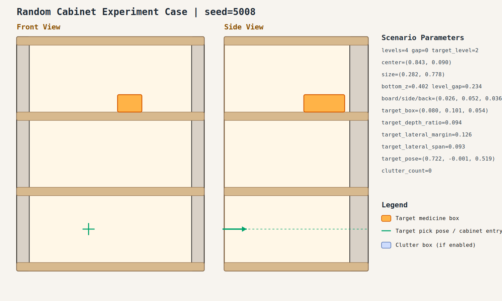

# case_001

## Result

- Success: `False`
- Final stage: `INSERT_AND_SUCTION`
- Failure message: `lift_reference_tool_height: FK request timed out.`

## Parameters

- Seed: `5008`
- Shelf levels: `4`
- Target gap index: `0`
- Target level: `2`
- Shelf center: `(0.843, 0.090)`
- Shelf size (depth,width): `(0.282, 0.778)`
- Shelf bottom / level gap: `(0.402, 0.234)`
- Shelf board / side / back thickness: `(0.026, 0.052, 0.036)`
- Target box size: `(0.080, 0.101, 0.054)`
- Target pose: `(0.722, -0.001, 0.519)`

## Stage Durations

- `ACQUIRE_TARGET`: 1.701s
- `ARM_STOW_SAFE`: 2.212s
- `BASE_ENTER_WORKSPACE`: 0.254s
- `LIFT_TO_BAND`: 2.212s
- `SELECT_PRE_INSERT`: 0.387s
- `PLAN_TO_PRE_INSERT`: 5.119s
- `INSERT_AND_SUCTION`: 10.308s
- `SELECT_PRE_INSERT`: 0.384s
- `PLAN_TO_PRE_INSERT`: 1.447s
- `INSERT_AND_SUCTION`: 10.355s
- `SELECT_PRE_INSERT`: 0.389s
- `PLAN_TO_PRE_INSERT`: 0.000s
- `INSERT_AND_SUCTION`: 11.434s
- `SELECT_PRE_INSERT`: 0.397s
- `PLAN_TO_PRE_INSERT`: 1.459s
- `INSERT_AND_SUCTION`: 10.449s
- `SELECT_PRE_INSERT`: 0.381s
- `PLAN_TO_PRE_INSERT`: 1.449s

## Video

- No video metadata was generated for this case.

## Files

- `scene.svg`: cabinet image
- `params.json`: generated cabinet parameters
- `result.json`: parsed experiment result
- `run.log`: raw ROS/MoveIt log
