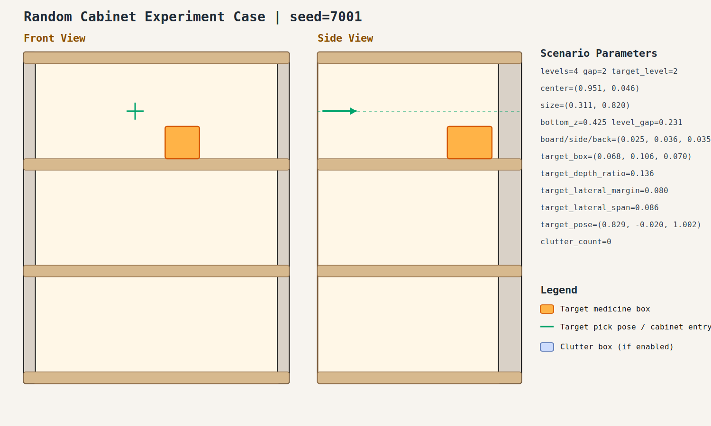
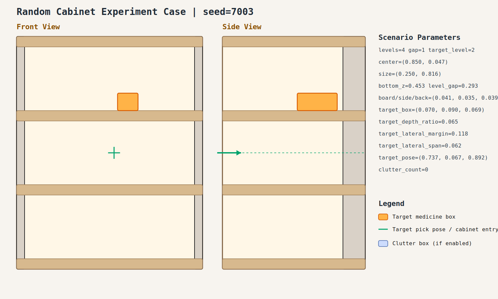
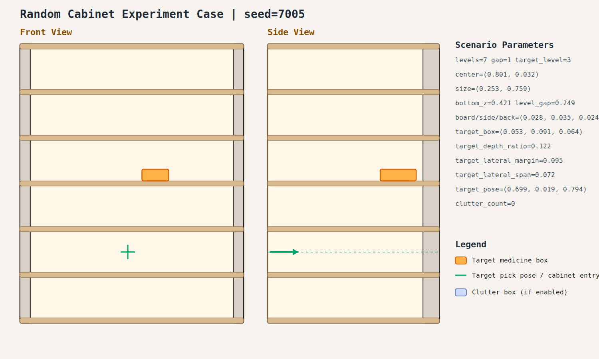
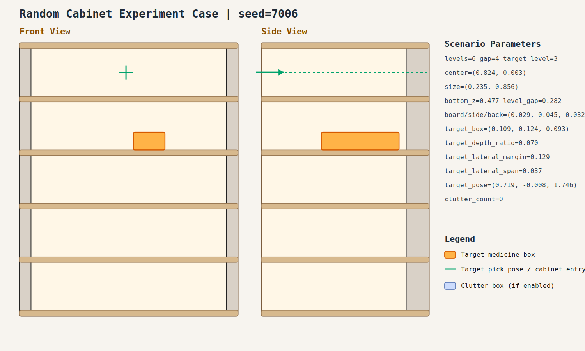

# Random Cabinet Experiment Record: 20260409_003642_random_cabinet_experiment

- Total cases: `10`
- Successful cases: `10`
- Success ratio: `100.0%`
- Failure analysis: [analysis.md](./analysis.md)

## Cases

### case_001

- Seed: `7001`
- Success: `True`
- Final stage: `COMPLETED`
- Shelf size (depth,width): `(0.311, 0.820)`
- Shelf center: `(0.951, 0.046)`
- Shelf bottom / level gap: `(0.425, 0.231)`
- Target box size: `(0.068, 0.106, 0.070)`
- Video recorded: `False`
- Failure message: `N/A`
- Stage durations:
- `ACQUIRE_TARGET`: 1.643s
- `ARM_STOW_SAFE`: 2.792s
- `BASE_ENTER_WORKSPACE`: 2.716s
- `LIFT_TO_BAND`: 2.212s
- `SELECT_PRE_INSERT`: 0.383s
- `PLAN_TO_PRE_INSERT`: 1.514s
- `INSERT_AND_SUCTION`: 0.689s
- `SAFE_RETREAT`: 2.886s
- Detailed record: [README.md](./case_001/README.md)

### case_002

- Seed: `7002`
- Success: `True`
- Final stage: `COMPLETED`
- Shelf size (depth,width): `(0.276, 0.885)`
- Shelf center: `(0.920, -0.049)`
- Shelf bottom / level gap: `(0.546, 0.287)`
- Target box size: `(0.073, 0.110, 0.063)`
- Video recorded: `False`
- Failure message: `N/A`
- Stage durations:
- `ACQUIRE_TARGET`: 0.614s
- `ARM_STOW_SAFE`: 2.301s
- `BASE_ENTER_WORKSPACE`: 2.712s
- `LIFT_TO_BAND`: 2.218s
- `SELECT_PRE_INSERT`: 0.393s
- `PLAN_TO_PRE_INSERT`: 0.000s
- `INSERT_AND_SUCTION`: 2.051s
- `SAFE_RETREAT`: 3.234s
- Detailed record: [README.md](./case_002/README.md)

### case_003

- Seed: `7003`
- Success: `True`
- Final stage: `COMPLETED`
- Shelf size (depth,width): `(0.250, 0.816)`
- Shelf center: `(0.850, 0.047)`
- Shelf bottom / level gap: `(0.453, 0.293)`
- Target box size: `(0.070, 0.090, 0.069)`
- Video recorded: `False`
- Failure message: `N/A`
- Stage durations:
- `ACQUIRE_TARGET`: 0.690s
- `ARM_STOW_SAFE`: 2.300s
- `BASE_ENTER_WORKSPACE`: 2.721s
- `LIFT_TO_BAND`: 2.213s
- `SELECT_PRE_INSERT`: 0.395s
- `PLAN_TO_PRE_INSERT`: 1.554s
- `INSERT_AND_SUCTION`: 0.625s
- `SAFE_RETREAT`: 2.828s
- Detailed record: [README.md](./case_003/README.md)

### case_004

- Seed: `7004`
- Success: `True`
- Final stage: `COMPLETED`
- Shelf size (depth,width): `(0.213, 0.783)`
- Shelf center: `(0.835, 0.072)`
- Shelf bottom / level gap: `(0.463, 0.295)`
- Target box size: `(0.054, 0.154, 0.046)`
- Video recorded: `False`
- Failure message: `N/A`
- Stage durations:
- `ACQUIRE_TARGET`: 0.690s
- `ARM_STOW_SAFE`: 2.302s
- `BASE_ENTER_WORKSPACE`: 2.711s
- `LIFT_TO_BAND`: 2.228s
- `SELECT_PRE_INSERT`: 0.382s
- `PLAN_TO_PRE_INSERT`: 1.531s
- `INSERT_AND_SUCTION`: 0.000s
- `SAFE_RETREAT`: 4.727s
- Detailed record: [README.md](./case_004/README.md)

### case_005

- Seed: `7005`
- Success: `True`
- Final stage: `COMPLETED`
- Shelf size (depth,width): `(0.253, 0.759)`
- Shelf center: `(0.801, 0.032)`
- Shelf bottom / level gap: `(0.421, 0.249)`
- Target box size: `(0.053, 0.091, 0.064)`
- Video recorded: `False`
- Failure message: `N/A`
- Stage durations:
- `ACQUIRE_TARGET`: 0.652s
- `ARM_STOW_SAFE`: 2.304s
- `BASE_ENTER_WORKSPACE`: 2.715s
- `LIFT_TO_BAND`: 2.210s
- `SELECT_PRE_INSERT`: 0.383s
- `PLAN_TO_PRE_INSERT`: 1.533s
- `INSERT_AND_SUCTION`: 0.652s
- `SAFE_RETREAT`: 2.857s
- Detailed record: [README.md](./case_005/README.md)

### case_006

- Seed: `7006`
- Success: `True`
- Final stage: `COMPLETED`
- Shelf size (depth,width): `(0.235, 0.856)`
- Shelf center: `(0.824, 0.003)`
- Shelf bottom / level gap: `(0.477, 0.282)`
- Target box size: `(0.109, 0.124, 0.093)`
- Video recorded: `False`
- Failure message: `N/A`
- Stage durations:
- `ACQUIRE_TARGET`: 0.645s
- `ARM_STOW_SAFE`: 2.298s
- `BASE_ENTER_WORKSPACE`: 2.713s
- `LIFT_TO_BAND`: 2.210s
- `SELECT_PRE_INSERT`: 0.391s
- `PLAN_TO_PRE_INSERT`: 1.854s
- `INSERT_AND_SUCTION`: 0.631s
- `SAFE_RETREAT`: 2.829s
- Detailed record: [README.md](./case_006/README.md)

### case_007

- Seed: `7007`
- Success: `True`
- Final stage: `COMPLETED`
- Shelf size (depth,width): `(0.296, 0.670)`
- Shelf center: `(0.814, 0.023)`
- Shelf bottom / level gap: `(0.489, 0.236)`
- Target box size: `(0.097, 0.122, 0.083)`
- Video recorded: `False`
- Failure message: `N/A`
- Stage durations:
- `ACQUIRE_TARGET`: 2.562s
- `ARM_STOW_SAFE`: 2.308s
- `BASE_ENTER_WORKSPACE`: 2.710s
- `LIFT_TO_BAND`: 2.209s
- `SELECT_PRE_INSERT`: 0.377s
- `PLAN_TO_PRE_INSERT`: 1.529s
- `INSERT_AND_SUCTION`: 0.646s
- `SAFE_RETREAT`: 2.842s
- Detailed record: [README.md](./case_007/README.md)

### case_008

- Seed: `7008`
- Success: `True`
- Final stage: `COMPLETED`
- Shelf size (depth,width): `(0.303, 0.826)`
- Shelf center: `(0.852, -0.012)`
- Shelf bottom / level gap: `(0.428, 0.298)`
- Target box size: `(0.098, 0.111, 0.048)`
- Video recorded: `False`
- Failure message: `N/A`
- Stage durations:
- `ACQUIRE_TARGET`: 0.674s
- `ARM_STOW_SAFE`: 2.303s
- `BASE_ENTER_WORKSPACE`: 2.711s
- `LIFT_TO_BAND`: 2.211s
- `SELECT_PRE_INSERT`: 0.380s
- `PLAN_TO_PRE_INSERT`: 5.413s
- `INSERT_AND_SUCTION`: 10.540s
- `PLAN_TO_PRE_INSERT`: 1.444s
- `INSERT_AND_SUCTION`: 10.599s
- `PLAN_TO_PRE_INSERT`: 1.446s
- `INSERT_AND_SUCTION`: 0.744s
- `SAFE_RETREAT`: 2.943s
- Detailed record: [README.md](./case_008/README.md)

### case_009

- Seed: `7009`
- Success: `True`
- Final stage: `COMPLETED`
- Shelf size (depth,width): `(0.277, 0.728)`
- Shelf center: `(0.938, 0.045)`
- Shelf bottom / level gap: `(0.564, 0.219)`
- Target box size: `(0.096, 0.094, 0.084)`
- Video recorded: `False`
- Failure message: `N/A`
- Stage durations:
- `ACQUIRE_TARGET`: 0.678s
- `ARM_STOW_SAFE`: 2.300s
- `BASE_ENTER_WORKSPACE`: 2.711s
- `LIFT_TO_BAND`: 2.211s
- `SELECT_PRE_INSERT`: 0.379s
- `PLAN_TO_PRE_INSERT`: 1.528s
- `INSERT_AND_SUCTION`: 0.643s
- `SAFE_RETREAT`: 2.834s
- Detailed record: [README.md](./case_009/README.md)

### case_010

- Seed: `7010`
- Success: `True`
- Final stage: `COMPLETED`
- Shelf size (depth,width): `(0.299, 0.783)`
- Shelf center: `(0.879, -0.102)`
- Shelf bottom / level gap: `(0.498, 0.278)`
- Target box size: `(0.086, 0.107, 0.085)`
- Video recorded: `False`
- Failure message: `N/A`
- Stage durations:
- `ACQUIRE_TARGET`: 12.495s
- `ARM_STOW_SAFE`: 2.207s
- `BASE_ENTER_WORKSPACE`: 2.709s
- `LIFT_TO_BAND`: 0.000s
- `SELECT_PRE_INSERT`: 1.792s
- `PLAN_TO_PRE_INSERT`: 1.523s
- `INSERT_AND_SUCTION`: 0.661s
- `SAFE_RETREAT`: 2.861s
- Detailed record: [README.md](./case_010/README.md)
