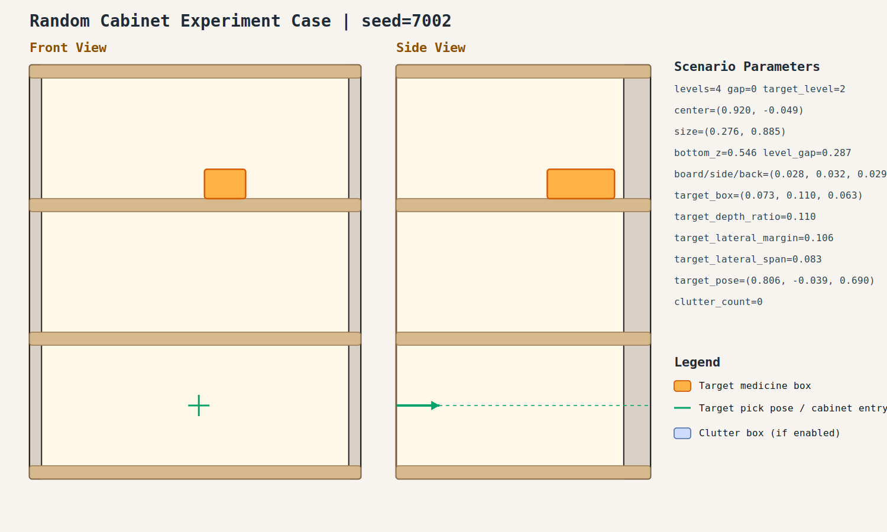

# case_002

## Result

- Success: `True`
- Final stage: `COMPLETED`

## Parameters

- Seed: `7002`
- Shelf levels: `4`
- Target gap index: `0`
- Target level: `2`
- Shelf center: `(0.920, -0.049)`
- Shelf size (depth,width): `(0.276, 0.885)`
- Shelf bottom / level gap: `(0.546, 0.287)`
- Shelf board / side / back thickness: `(0.028, 0.032, 0.029)`
- Target box size: `(0.073, 0.110, 0.063)`
- Target pose: `(0.806, -0.039, 0.690)`

## Stage Durations

- `ACQUIRE_TARGET`: 0.614s
- `ARM_STOW_SAFE`: 2.301s
- `BASE_ENTER_WORKSPACE`: 2.712s
- `LIFT_TO_BAND`: 2.218s
- `SELECT_PRE_INSERT`: 0.393s
- `PLAN_TO_PRE_INSERT`: 0.000s
- `INSERT_AND_SUCTION`: 2.051s
- `SAFE_RETREAT`: 3.234s

## Video

- No video metadata was generated for this case.

## Files

- `scene.svg`: cabinet image
- `params.json`: generated cabinet parameters
- `result.json`: parsed experiment result
- `run.log`: raw ROS/MoveIt log
