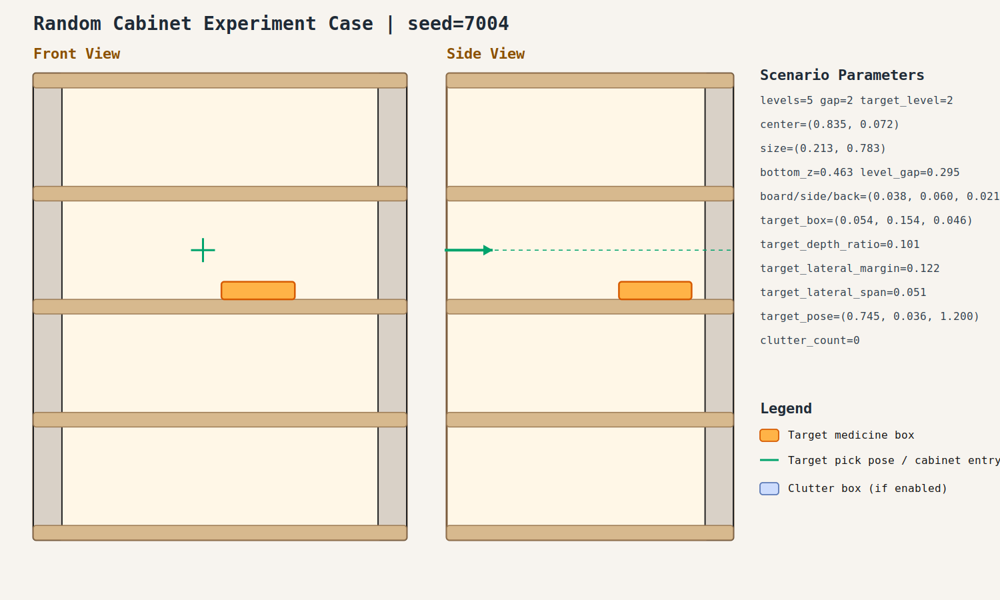

# case_004

## Result

- Success: `True`
- Final stage: `COMPLETED`

## Parameters

- Seed: `7004`
- Shelf levels: `5`
- Target gap index: `2`
- Target level: `2`
- Shelf center: `(0.835, 0.072)`
- Shelf size (depth,width): `(0.213, 0.783)`
- Shelf bottom / level gap: `(0.463, 0.295)`
- Shelf board / side / back thickness: `(0.038, 0.060, 0.021)`
- Target box size: `(0.054, 0.154, 0.046)`
- Target pose: `(0.745, 0.036, 1.200)`

## Stage Durations

- `ACQUIRE_TARGET`: 0.690s
- `ARM_STOW_SAFE`: 2.302s
- `BASE_ENTER_WORKSPACE`: 2.711s
- `LIFT_TO_BAND`: 2.228s
- `SELECT_PRE_INSERT`: 0.382s
- `PLAN_TO_PRE_INSERT`: 1.531s
- `INSERT_AND_SUCTION`: 0.000s
- `SAFE_RETREAT`: 4.727s

## Video

- No video metadata was generated for this case.

## Files

- `scene.svg`: cabinet image
- `params.json`: generated cabinet parameters
- `result.json`: parsed experiment result
- `run.log`: raw ROS/MoveIt log
