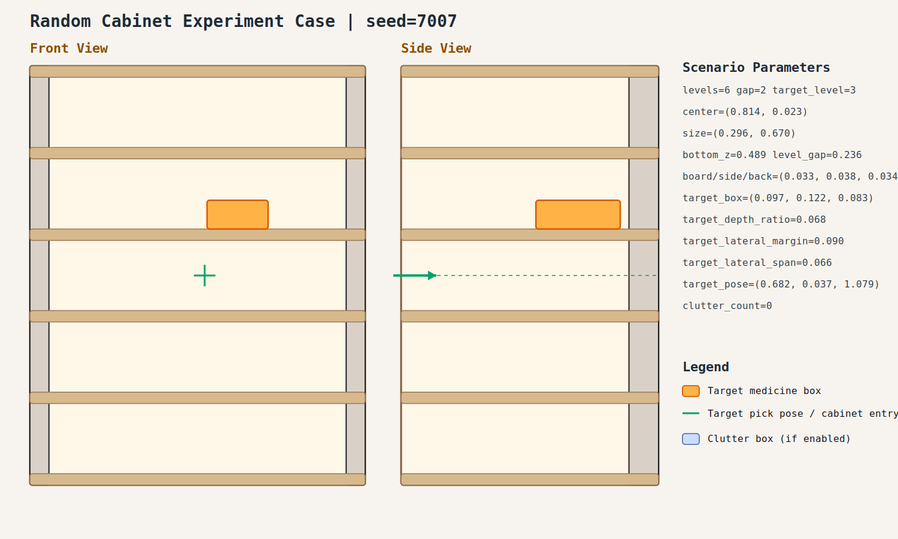

# case_007

## Result

- Success: `True`
- Final stage: `COMPLETED`

## Parameters

- Seed: `7007`
- Shelf levels: `6`
- Target gap index: `2`
- Target level: `3`
- Shelf center: `(0.814, 0.023)`
- Shelf size (depth,width): `(0.296, 0.670)`
- Shelf bottom / level gap: `(0.489, 0.236)`
- Shelf board / side / back thickness: `(0.033, 0.038, 0.034)`
- Target box size: `(0.097, 0.122, 0.083)`
- Target pose: `(0.682, 0.037, 1.079)`

## Stage Durations

- `ACQUIRE_TARGET`: 2.562s
- `ARM_STOW_SAFE`: 2.308s
- `BASE_ENTER_WORKSPACE`: 2.710s
- `LIFT_TO_BAND`: 2.209s
- `SELECT_PRE_INSERT`: 0.377s
- `PLAN_TO_PRE_INSERT`: 1.529s
- `INSERT_AND_SUCTION`: 0.646s
- `SAFE_RETREAT`: 2.842s

## Video

- No video metadata was generated for this case.

## Files

- `scene.svg`: cabinet image
- `params.json`: generated cabinet parameters
- `result.json`: parsed experiment result
- `run.log`: raw ROS/MoveIt log
