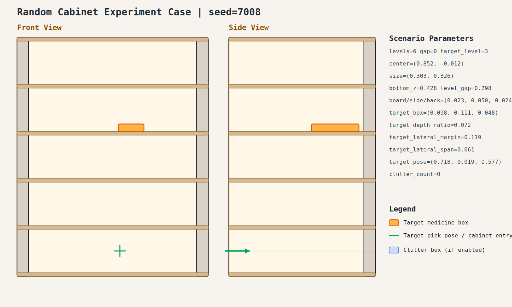

# case_008

## Result

- Success: `True`
- Final stage: `COMPLETED`

## Parameters

- Seed: `7008`
- Shelf levels: `6`
- Target gap index: `0`
- Target level: `3`
- Shelf center: `(0.852, -0.012)`
- Shelf size (depth,width): `(0.303, 0.826)`
- Shelf bottom / level gap: `(0.428, 0.298)`
- Shelf board / side / back thickness: `(0.023, 0.050, 0.024)`
- Target box size: `(0.098, 0.111, 0.048)`
- Target pose: `(0.718, 0.019, 0.577)`

## Stage Durations

- `ACQUIRE_TARGET`: 0.674s
- `ARM_STOW_SAFE`: 2.303s
- `BASE_ENTER_WORKSPACE`: 2.711s
- `LIFT_TO_BAND`: 2.211s
- `SELECT_PRE_INSERT`: 0.380s
- `PLAN_TO_PRE_INSERT`: 5.413s
- `INSERT_AND_SUCTION`: 10.540s
- `PLAN_TO_PRE_INSERT`: 1.444s
- `INSERT_AND_SUCTION`: 10.599s
- `PLAN_TO_PRE_INSERT`: 1.446s
- `INSERT_AND_SUCTION`: 0.744s
- `SAFE_RETREAT`: 2.943s

## Video

- No video metadata was generated for this case.

## Files

- `scene.svg`: cabinet image
- `params.json`: generated cabinet parameters
- `result.json`: parsed experiment result
- `run.log`: raw ROS/MoveIt log
