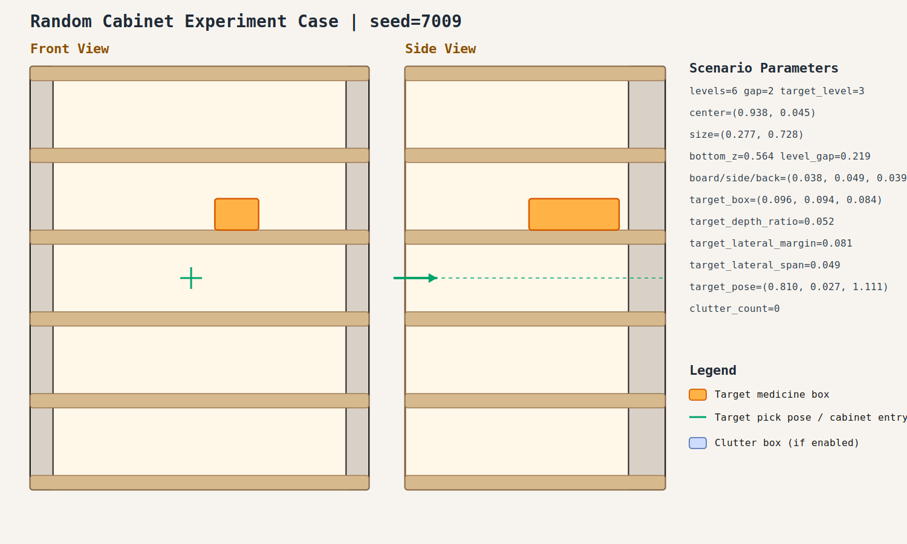

# case_009

## Result

- Success: `True`
- Final stage: `COMPLETED`

## Parameters

- Seed: `7009`
- Shelf levels: `6`
- Target gap index: `2`
- Target level: `3`
- Shelf center: `(0.938, 0.045)`
- Shelf size (depth,width): `(0.277, 0.728)`
- Shelf bottom / level gap: `(0.564, 0.219)`
- Shelf board / side / back thickness: `(0.038, 0.049, 0.039)`
- Target box size: `(0.096, 0.094, 0.084)`
- Target pose: `(0.810, 0.027, 1.111)`

## Stage Durations

- `ACQUIRE_TARGET`: 0.678s
- `ARM_STOW_SAFE`: 2.300s
- `BASE_ENTER_WORKSPACE`: 2.711s
- `LIFT_TO_BAND`: 2.211s
- `SELECT_PRE_INSERT`: 0.379s
- `PLAN_TO_PRE_INSERT`: 1.528s
- `INSERT_AND_SUCTION`: 0.643s
- `SAFE_RETREAT`: 2.834s

## Video

- No video metadata was generated for this case.

## Files

- `scene.svg`: cabinet image
- `params.json`: generated cabinet parameters
- `result.json`: parsed experiment result
- `run.log`: raw ROS/MoveIt log
