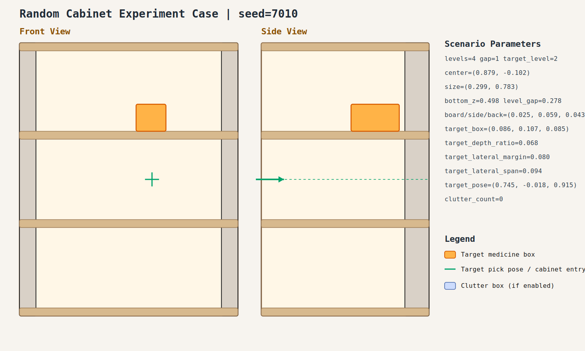

# case_010

## Result

- Success: `True`
- Final stage: `COMPLETED`

## Parameters

- Seed: `7010`
- Shelf levels: `4`
- Target gap index: `1`
- Target level: `2`
- Shelf center: `(0.879, -0.102)`
- Shelf size (depth,width): `(0.299, 0.783)`
- Shelf bottom / level gap: `(0.498, 0.278)`
- Shelf board / side / back thickness: `(0.025, 0.059, 0.043)`
- Target box size: `(0.086, 0.107, 0.085)`
- Target pose: `(0.745, -0.018, 0.915)`

## Stage Durations

- `ACQUIRE_TARGET`: 12.495s
- `ARM_STOW_SAFE`: 2.207s
- `BASE_ENTER_WORKSPACE`: 2.709s
- `LIFT_TO_BAND`: 0.000s
- `SELECT_PRE_INSERT`: 1.792s
- `PLAN_TO_PRE_INSERT`: 1.523s
- `INSERT_AND_SUCTION`: 0.661s
- `SAFE_RETREAT`: 2.861s

## Video

- No video metadata was generated for this case.

## Files

- `scene.svg`: cabinet image
- `params.json`: generated cabinet parameters
- `result.json`: parsed experiment result
- `run.log`: raw ROS/MoveIt log
