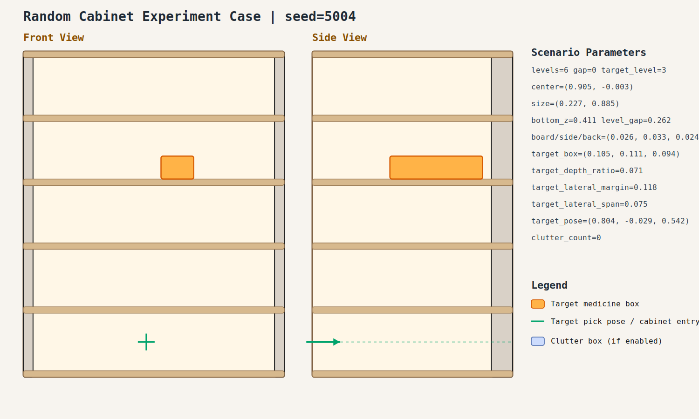

# Random Cabinet Experiment Record: 20260409_100417_random_cabinet_experiment

- Total cases: `1`
- Successful cases: `0`
- Success ratio: `0.0%`
- Failure analysis: [analysis.md](./analysis.md)

## Cases

### case_001

- Seed: `5004`
- Success: `False`
- Final stage: `FAILED`
- Shelf size (depth,width): `(0.227, 0.885)`
- Shelf center: `(0.905, -0.003)`
- Shelf bottom / level gap: `(0.411, 0.262)`
- Target box size: `(0.105, 0.111, 0.094)`
- Video recorded: `False`
- Failure message: `No feasible outside-cabinet pre-insert candidate found.`
- Stage durations:
- `ACQUIRE_TARGET`: 0.696s
- `ARM_STOW_SAFE`: 2.304s
- `BASE_ENTER_WORKSPACE`: 2.719s
- `LIFT_TO_BAND`: 2.215s
- `SELECT_PRE_INSERT`: 0.444s
- `PLAN_TO_PRE_INSERT`: 3.909s
- `INSERT_AND_SUCTION`: 0.236s
- `PLAN_TO_PRE_INSERT`: 1.444s
- `INSERT_AND_SUCTION`: 0.236s
- `PLAN_TO_PRE_INSERT`: 1.461s
- `INSERT_AND_SUCTION`: 0.241s
- `SELECT_PRE_INSERT`: 0.388s
- Detailed record: [README.md](./case_001/README.md)
