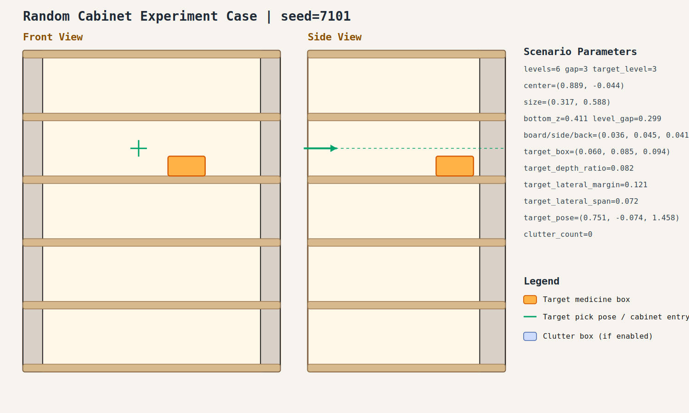
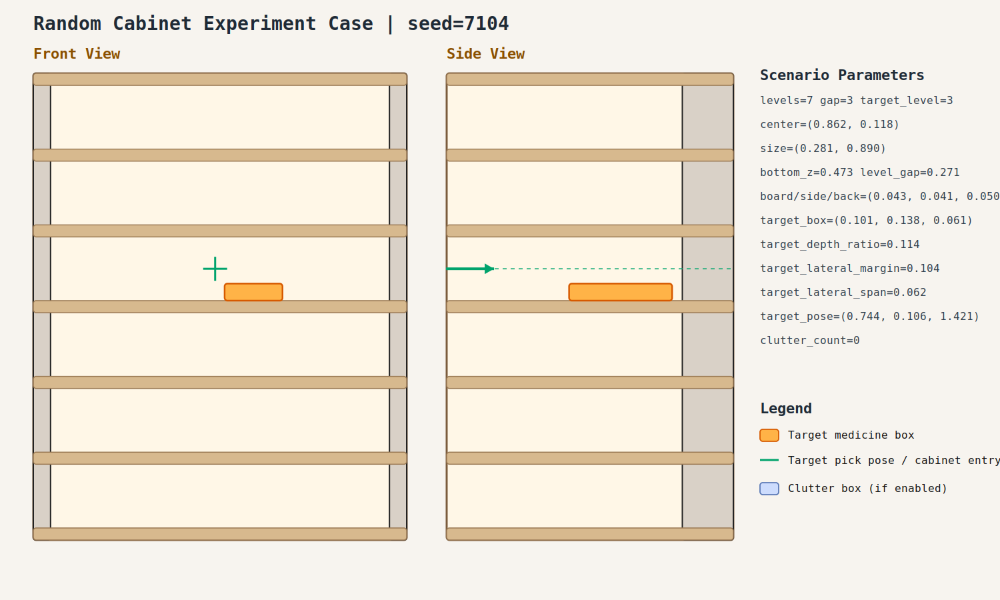

# Random Cabinet Experiment Record: 20260409_101028_random_cabinet_experiment

- Total cases: `5`
- Successful cases: `5`
- Success ratio: `100.0%`
- Failure analysis: [analysis.md](./analysis.md)

## Cases

### case_001

- Seed: `7101`
- Success: `True`
- Final stage: `COMPLETED`
- Shelf size (depth,width): `(0.317, 0.588)`
- Shelf center: `(0.889, -0.044)`
- Shelf bottom / level gap: `(0.411, 0.299)`
- Target box size: `(0.060, 0.085, 0.094)`
- Video recorded: `False`
- Failure message: `N/A`
- Stage durations:
- `ACQUIRE_TARGET`: 0.609s
- `ARM_STOW_SAFE`: 2.326s
- `BASE_ENTER_WORKSPACE`: 2.714s
- `LIFT_TO_BAND`: 2.211s
- `SELECT_PRE_INSERT`: 0.364s
- `PLAN_TO_PRE_INSERT`: 1.533s
- `INSERT_AND_SUCTION`: 0.666s
- `SAFE_RETREAT`: 2.865s
- Detailed record: [README.md](./case_001/README.md)

### case_002

- Seed: `7102`
- Success: `True`
- Final stage: `COMPLETED`
- Shelf size (depth,width): `(0.224, 0.743)`
- Shelf center: `(0.865, -0.075)`
- Shelf bottom / level gap: `(0.442, 0.223)`
- Target box size: `(0.053, 0.131, 0.096)`
- Video recorded: `False`
- Failure message: `N/A`
- Stage durations:
- `ACQUIRE_TARGET`: 2.465s
- `ARM_STOW_SAFE`: 2.232s
- `BASE_ENTER_WORKSPACE`: 2.713s
- `LIFT_TO_BAND`: 2.215s
- `SELECT_PRE_INSERT`: 0.398s
- `PLAN_TO_PRE_INSERT`: 6.461s
- `INSERT_AND_SUCTION`: 1.748s
- `SAFE_RETREAT`: 3.624s
- Detailed record: [README.md](./case_002/README.md)

### case_003

- Seed: `7103`
- Success: `True`
- Final stage: `COMPLETED`
- Shelf size (depth,width): `(0.232, 0.893)`
- Shelf center: `(0.937, -0.037)`
- Shelf bottom / level gap: `(0.447, 0.219)`
- Target box size: `(0.094, 0.157, 0.049)`
- Video recorded: `False`
- Failure message: `N/A`
- Stage durations:
- `ACQUIRE_TARGET`: 0.648s
- `ARM_STOW_SAFE`: 2.302s
- `BASE_ENTER_WORKSPACE`: 2.714s
- `LIFT_TO_BAND`: 0.000s
- `SELECT_PRE_INSERT`: 0.774s
- `PLAN_TO_PRE_INSERT`: 3.364s
- `INSERT_AND_SUCTION`: 1.751s
- `SAFE_RETREAT`: 3.629s
- Detailed record: [README.md](./case_003/README.md)

### case_004

- Seed: `7104`
- Success: `True`
- Final stage: `COMPLETED`
- Shelf size (depth,width): `(0.281, 0.890)`
- Shelf center: `(0.862, 0.118)`
- Shelf bottom / level gap: `(0.473, 0.271)`
- Target box size: `(0.101, 0.138, 0.061)`
- Video recorded: `False`
- Failure message: `N/A`
- Stage durations:
- `ACQUIRE_TARGET`: 1.796s
- `ARM_STOW_SAFE`: 2.308s
- `BASE_ENTER_WORKSPACE`: 2.716s
- `LIFT_TO_BAND`: 2.228s
- `SELECT_PRE_INSERT`: 0.396s
- `PLAN_TO_PRE_INSERT`: 1.534s
- `INSERT_AND_SUCTION`: 0.661s
- `SAFE_RETREAT`: 2.855s
- Detailed record: [README.md](./case_004/README.md)

### case_005

- Seed: `7105`
- Success: `True`
- Final stage: `COMPLETED`
- Shelf size (depth,width): `(0.313, 0.814)`
- Shelf center: `(0.826, 0.047)`
- Shelf bottom / level gap: `(0.484, 0.241)`
- Target box size: `(0.086, 0.088, 0.053)`
- Video recorded: `False`
- Failure message: `N/A`
- Stage durations:
- `ACQUIRE_TARGET`: 0.880s
- `ARM_STOW_SAFE`: 2.212s
- `BASE_ENTER_WORKSPACE`: 2.716s
- `LIFT_TO_BAND`: 2.214s
- `SELECT_PRE_INSERT`: 0.397s
- `PLAN_TO_PRE_INSERT`: 1.921s
- `INSERT_AND_SUCTION`: 0.667s
- `SAFE_RETREAT`: 2.860s
- Detailed record: [README.md](./case_005/README.md)
