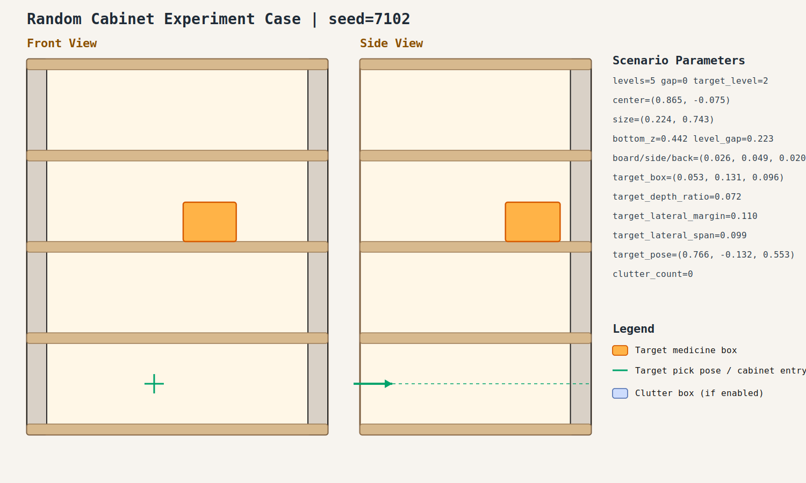

# case_002

## Result

- Success: `True`
- Final stage: `COMPLETED`

## Parameters

- Seed: `7102`
- Shelf levels: `5`
- Target gap index: `0`
- Target level: `2`
- Shelf center: `(0.865, -0.075)`
- Shelf size (depth,width): `(0.224, 0.743)`
- Shelf bottom / level gap: `(0.442, 0.223)`
- Shelf board / side / back thickness: `(0.026, 0.049, 0.020)`
- Target box size: `(0.053, 0.131, 0.096)`
- Target pose: `(0.766, -0.132, 0.553)`

## Stage Durations

- `ACQUIRE_TARGET`: 2.465s
- `ARM_STOW_SAFE`: 2.232s
- `BASE_ENTER_WORKSPACE`: 2.713s
- `LIFT_TO_BAND`: 2.215s
- `SELECT_PRE_INSERT`: 0.398s
- `PLAN_TO_PRE_INSERT`: 6.461s
- `INSERT_AND_SUCTION`: 1.748s
- `SAFE_RETREAT`: 3.624s

## Video

- No video metadata was generated for this case.

## Files

- `scene.svg`: cabinet image
- `params.json`: generated cabinet parameters
- `result.json`: parsed experiment result
- `run.log`: raw ROS/MoveIt log
