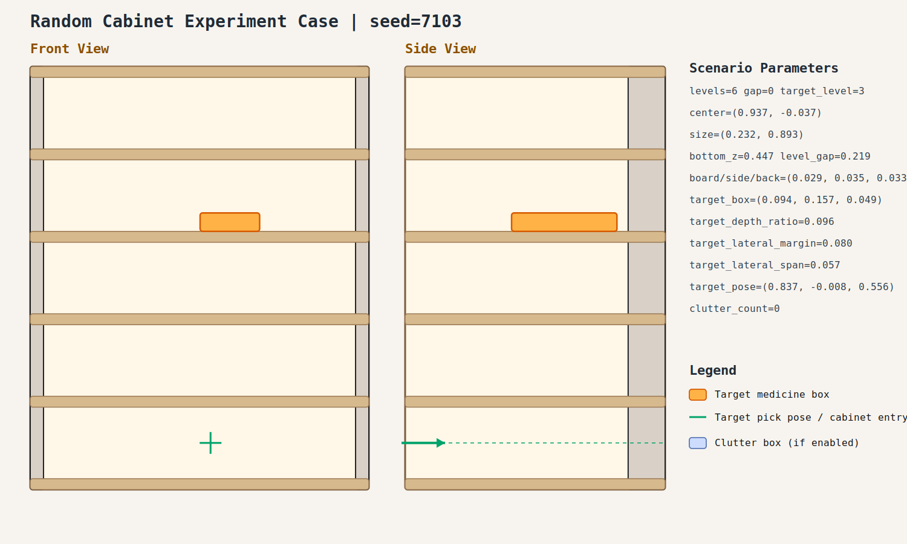

# case_003

## Result

- Success: `True`
- Final stage: `COMPLETED`

## Parameters

- Seed: `7103`
- Shelf levels: `6`
- Target gap index: `0`
- Target level: `3`
- Shelf center: `(0.937, -0.037)`
- Shelf size (depth,width): `(0.232, 0.893)`
- Shelf bottom / level gap: `(0.447, 0.219)`
- Shelf board / side / back thickness: `(0.029, 0.035, 0.033)`
- Target box size: `(0.094, 0.157, 0.049)`
- Target pose: `(0.837, -0.008, 0.556)`

## Stage Durations

- `ACQUIRE_TARGET`: 0.648s
- `ARM_STOW_SAFE`: 2.302s
- `BASE_ENTER_WORKSPACE`: 2.714s
- `LIFT_TO_BAND`: 0.000s
- `SELECT_PRE_INSERT`: 0.774s
- `PLAN_TO_PRE_INSERT`: 3.364s
- `INSERT_AND_SUCTION`: 1.751s
- `SAFE_RETREAT`: 3.629s

## Video

- No video metadata was generated for this case.

## Files

- `scene.svg`: cabinet image
- `params.json`: generated cabinet parameters
- `result.json`: parsed experiment result
- `run.log`: raw ROS/MoveIt log
