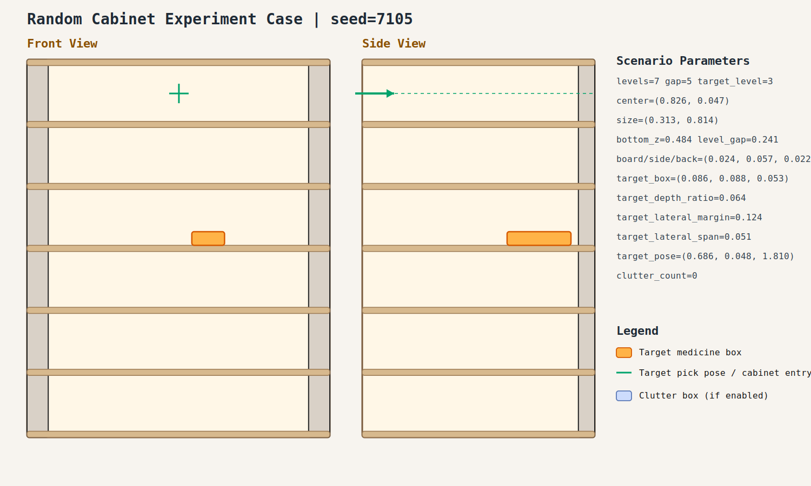

# case_005

## Result

- Success: `True`
- Final stage: `COMPLETED`

## Parameters

- Seed: `7105`
- Shelf levels: `7`
- Target gap index: `5`
- Target level: `3`
- Shelf center: `(0.826, 0.047)`
- Shelf size (depth,width): `(0.313, 0.814)`
- Shelf bottom / level gap: `(0.484, 0.241)`
- Shelf board / side / back thickness: `(0.024, 0.057, 0.022)`
- Target box size: `(0.086, 0.088, 0.053)`
- Target pose: `(0.686, 0.048, 1.810)`

## Stage Durations

- `ACQUIRE_TARGET`: 0.880s
- `ARM_STOW_SAFE`: 2.212s
- `BASE_ENTER_WORKSPACE`: 2.716s
- `LIFT_TO_BAND`: 2.214s
- `SELECT_PRE_INSERT`: 0.397s
- `PLAN_TO_PRE_INSERT`: 1.921s
- `INSERT_AND_SUCTION`: 0.667s
- `SAFE_RETREAT`: 2.860s

## Video

- No video metadata was generated for this case.

## Files

- `scene.svg`: cabinet image
- `params.json`: generated cabinet parameters
- `result.json`: parsed experiment result
- `run.log`: raw ROS/MoveIt log
