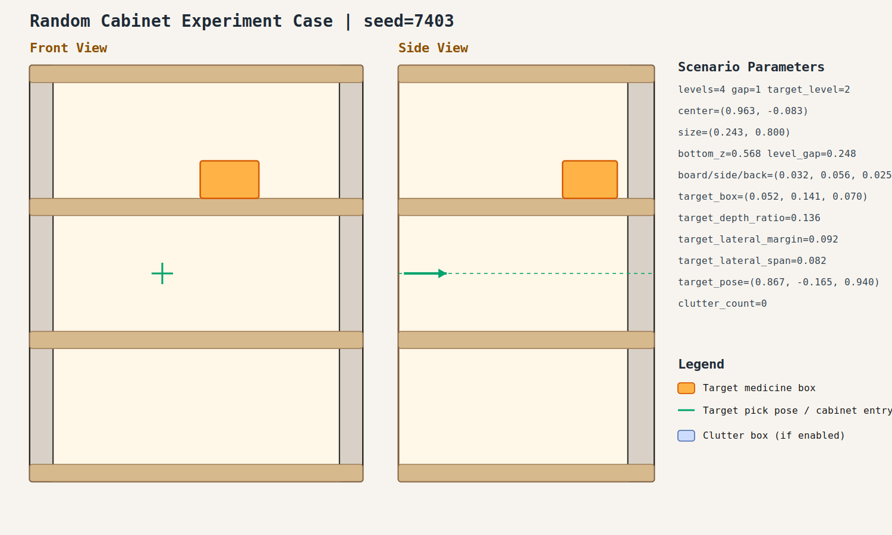

# Random Cabinet Experiment Record: 20260409_103536_random_cabinet_experiment

- Total cases: `5`
- Successful cases: `5`
- Success ratio: `100.0%`
- Failure analysis: [analysis.md](./analysis.md)

## Cases

### case_001

- Seed: `7401`
- Success: `True`
- Final stage: `COMPLETED`
- Shelf size (depth,width): `(0.316, 0.895)`
- Shelf center: `(0.964, -0.084)`
- Shelf bottom / level gap: `(0.485, 0.246)`
- Target box size: `(0.083, 0.150, 0.082)`
- Video recorded: `False`
- Failure message: `N/A`
- Stage durations:
- `ACQUIRE_TARGET`: 5.003s
- `ARM_STOW_SAFE`: 2.297s
- `BASE_ENTER_WORKSPACE`: 2.316s
- `LIFT_TO_BAND`: 2.219s
- `SELECT_PRE_INSERT`: 0.391s
- `PLAN_TO_PRE_INSERT`: 1.541s
- `INSERT_AND_SUCTION`: 0.685s
- `SAFE_RETREAT`: 2.470s
- Detailed record: [README.md](./case_001/README.md)

### case_002

- Seed: `7402`
- Success: `True`
- Final stage: `COMPLETED`
- Shelf size (depth,width): `(0.254, 0.761)`
- Shelf center: `(0.804, -0.111)`
- Shelf bottom / level gap: `(0.433, 0.236)`
- Target box size: `(0.067, 0.134, 0.097)`
- Video recorded: `False`
- Failure message: `N/A`
- Stage durations:
- `ACQUIRE_TARGET`: 4.365s
- `ARM_STOW_SAFE`: 2.303s
- `BASE_ENTER_WORKSPACE`: 2.300s
- `LIFT_TO_BAND`: 2.217s
- `SELECT_PRE_INSERT`: 0.408s
- `PLAN_TO_PRE_INSERT`: 1.552s
- `INSERT_AND_SUCTION`: 0.651s
- `SAFE_RETREAT`: 2.362s
- Detailed record: [README.md](./case_002/README.md)

### case_003

- Seed: `7403`
- Success: `True`
- Final stage: `COMPLETED`
- Shelf size (depth,width): `(0.243, 0.800)`
- Shelf center: `(0.963, -0.083)`
- Shelf bottom / level gap: `(0.568, 0.248)`
- Target box size: `(0.052, 0.141, 0.070)`
- Video recorded: `False`
- Failure message: `N/A`
- Stage durations:
- `ACQUIRE_TARGET`: 0.634s
- `ARM_STOW_SAFE`: 2.311s
- `BASE_ENTER_WORKSPACE`: 2.717s
- `LIFT_TO_BAND`: 2.214s
- `SELECT_PRE_INSERT`: 0.389s
- `PLAN_TO_PRE_INSERT`: 1.546s
- `INSERT_AND_SUCTION`: 0.675s
- `SAFE_RETREAT`: 2.864s
- Detailed record: [README.md](./case_003/README.md)

### case_004

- Seed: `7404`
- Success: `True`
- Final stage: `COMPLETED`
- Shelf size (depth,width): `(0.220, 0.774)`
- Shelf center: `(0.919, 0.001)`
- Shelf bottom / level gap: `(0.468, 0.191)`
- Target box size: `(0.091, 0.083, 0.045)`
- Video recorded: `False`
- Failure message: `N/A`
- Stage durations:
- `ACQUIRE_TARGET`: 0.631s
- `ARM_STOW_SAFE`: 2.302s
- `BASE_ENTER_WORKSPACE`: 2.216s
- `LIFT_TO_BAND`: 2.226s
- `SELECT_PRE_INSERT`: 0.417s
- `PLAN_TO_PRE_INSERT`: 1.043s
- `INSERT_AND_SUCTION`: 0.659s
- `SAFE_RETREAT`: 2.852s
- Detailed record: [README.md](./case_004/README.md)

### case_005

- Seed: `7405`
- Success: `True`
- Final stage: `COMPLETED`
- Shelf size (depth,width): `(0.233, 0.796)`
- Shelf center: `(0.822, 0.108)`
- Shelf bottom / level gap: `(0.422, 0.244)`
- Target box size: `(0.068, 0.098, 0.053)`
- Video recorded: `False`
- Failure message: `N/A`
- Stage durations:
- `ACQUIRE_TARGET`: 0.621s
- `ARM_STOW_SAFE`: 2.303s
- `BASE_ENTER_WORKSPACE`: 2.715s
- `LIFT_TO_BAND`: 2.213s
- `SELECT_PRE_INSERT`: 0.407s
- `PLAN_TO_PRE_INSERT`: 1.566s
- `INSERT_AND_SUCTION`: 0.643s
- `SAFE_RETREAT`: 2.830s
- Detailed record: [README.md](./case_005/README.md)
