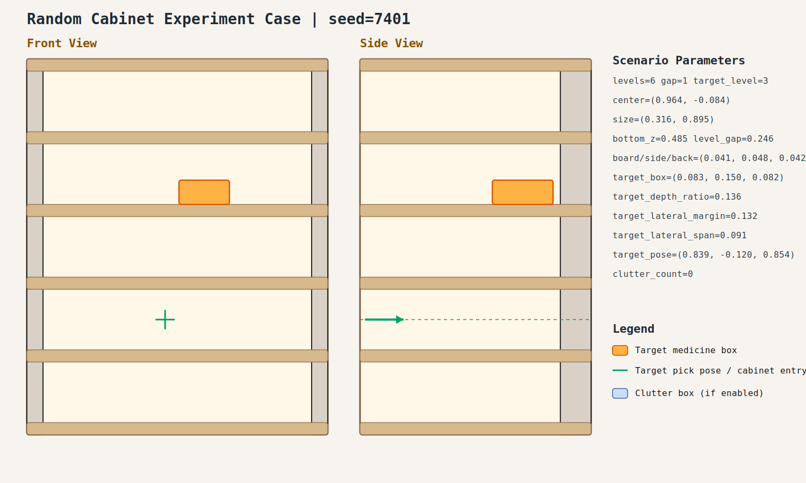

# case_001

## Result

- Success: `True`
- Final stage: `COMPLETED`

## Parameters

- Seed: `7401`
- Shelf levels: `6`
- Target gap index: `1`
- Target level: `3`
- Shelf center: `(0.964, -0.084)`
- Shelf size (depth,width): `(0.316, 0.895)`
- Shelf bottom / level gap: `(0.485, 0.246)`
- Shelf board / side / back thickness: `(0.041, 0.048, 0.042)`
- Target box size: `(0.083, 0.150, 0.082)`
- Target pose: `(0.839, -0.120, 0.854)`

## Stage Durations

- `ACQUIRE_TARGET`: 5.003s
- `ARM_STOW_SAFE`: 2.297s
- `BASE_ENTER_WORKSPACE`: 2.316s
- `LIFT_TO_BAND`: 2.219s
- `SELECT_PRE_INSERT`: 0.391s
- `PLAN_TO_PRE_INSERT`: 1.541s
- `INSERT_AND_SUCTION`: 0.685s
- `SAFE_RETREAT`: 2.470s

## Video

- No video metadata was generated for this case.

## Files

- `scene.svg`: cabinet image
- `params.json`: generated cabinet parameters
- `result.json`: parsed experiment result
- `run.log`: raw ROS/MoveIt log
