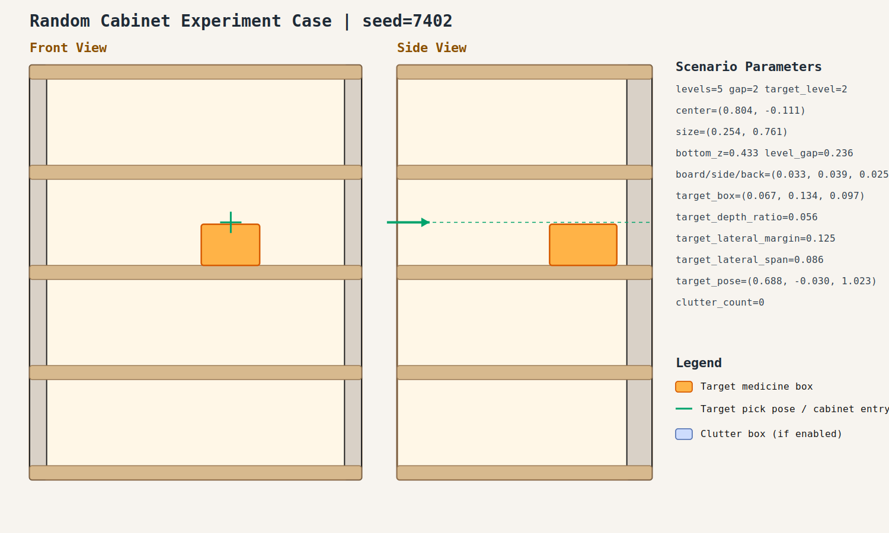

# case_002

## Result

- Success: `True`
- Final stage: `COMPLETED`

## Parameters

- Seed: `7402`
- Shelf levels: `5`
- Target gap index: `2`
- Target level: `2`
- Shelf center: `(0.804, -0.111)`
- Shelf size (depth,width): `(0.254, 0.761)`
- Shelf bottom / level gap: `(0.433, 0.236)`
- Shelf board / side / back thickness: `(0.033, 0.039, 0.025)`
- Target box size: `(0.067, 0.134, 0.097)`
- Target pose: `(0.688, -0.030, 1.023)`

## Stage Durations

- `ACQUIRE_TARGET`: 4.365s
- `ARM_STOW_SAFE`: 2.303s
- `BASE_ENTER_WORKSPACE`: 2.300s
- `LIFT_TO_BAND`: 2.217s
- `SELECT_PRE_INSERT`: 0.408s
- `PLAN_TO_PRE_INSERT`: 1.552s
- `INSERT_AND_SUCTION`: 0.651s
- `SAFE_RETREAT`: 2.362s

## Video

- No video metadata was generated for this case.

## Files

- `scene.svg`: cabinet image
- `params.json`: generated cabinet parameters
- `result.json`: parsed experiment result
- `run.log`: raw ROS/MoveIt log
