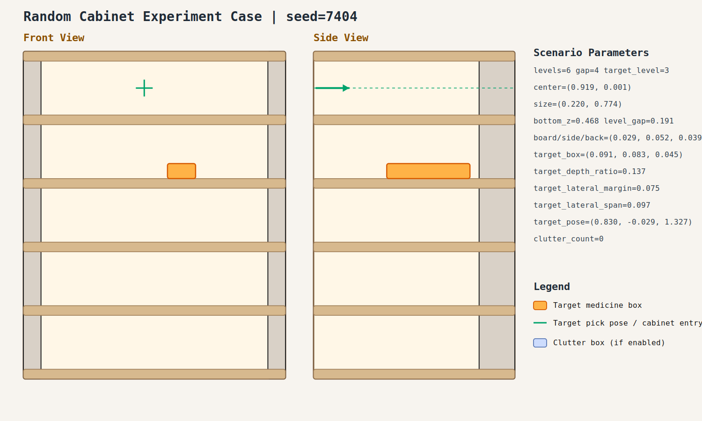

# case_004

## Result

- Success: `True`
- Final stage: `COMPLETED`

## Parameters

- Seed: `7404`
- Shelf levels: `6`
- Target gap index: `4`
- Target level: `3`
- Shelf center: `(0.919, 0.001)`
- Shelf size (depth,width): `(0.220, 0.774)`
- Shelf bottom / level gap: `(0.468, 0.191)`
- Shelf board / side / back thickness: `(0.029, 0.052, 0.039)`
- Target box size: `(0.091, 0.083, 0.045)`
- Target pose: `(0.830, -0.029, 1.327)`

## Stage Durations

- `ACQUIRE_TARGET`: 0.631s
- `ARM_STOW_SAFE`: 2.302s
- `BASE_ENTER_WORKSPACE`: 2.216s
- `LIFT_TO_BAND`: 2.226s
- `SELECT_PRE_INSERT`: 0.417s
- `PLAN_TO_PRE_INSERT`: 1.043s
- `INSERT_AND_SUCTION`: 0.659s
- `SAFE_RETREAT`: 2.852s

## Video

- No video metadata was generated for this case.

## Files

- `scene.svg`: cabinet image
- `params.json`: generated cabinet parameters
- `result.json`: parsed experiment result
- `run.log`: raw ROS/MoveIt log
