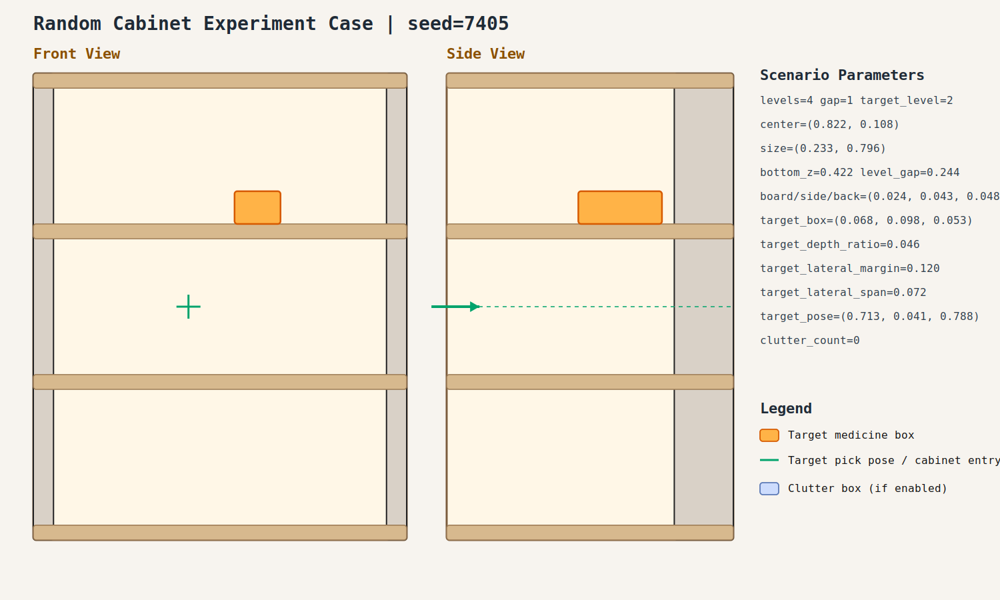

# case_005

## Result

- Success: `True`
- Final stage: `COMPLETED`

## Parameters

- Seed: `7405`
- Shelf levels: `4`
- Target gap index: `1`
- Target level: `2`
- Shelf center: `(0.822, 0.108)`
- Shelf size (depth,width): `(0.233, 0.796)`
- Shelf bottom / level gap: `(0.422, 0.244)`
- Shelf board / side / back thickness: `(0.024, 0.043, 0.048)`
- Target box size: `(0.068, 0.098, 0.053)`
- Target pose: `(0.713, 0.041, 0.788)`

## Stage Durations

- `ACQUIRE_TARGET`: 0.621s
- `ARM_STOW_SAFE`: 2.303s
- `BASE_ENTER_WORKSPACE`: 2.715s
- `LIFT_TO_BAND`: 2.213s
- `SELECT_PRE_INSERT`: 0.407s
- `PLAN_TO_PRE_INSERT`: 1.566s
- `INSERT_AND_SUCTION`: 0.643s
- `SAFE_RETREAT`: 2.830s

## Video

- No video metadata was generated for this case.

## Files

- `scene.svg`: cabinet image
- `params.json`: generated cabinet parameters
- `result.json`: parsed experiment result
- `run.log`: raw ROS/MoveIt log
